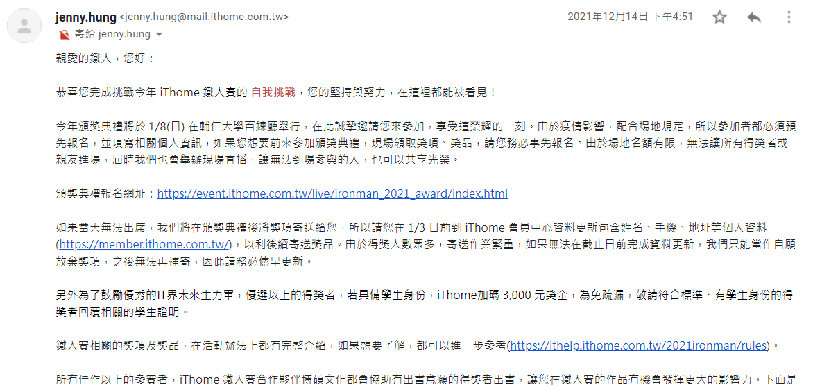

# Day1-又到了鐵人賽開賽了呢，我去年怎麼那麼糊塗呢(

## 作者的廢話(

哈囉我又來了，先來講講有關於為甚麼標題長這樣(

事情是這樣的，去年完賽後聽說歷年有在輔仁大學有頒獎典禮等等的活動，所以我就靜靜的等待通知，不料一直沒收到通知，我也漸漸的淡忘這件事情...

直到今年6月，突然想起一件事，那就是我IT邦註冊的電子郵件不是平常的那隻，馬上打開不常用的電子郵件...

沒錯，不只忘記領完賽獎狀，還忘記去參加典禮跟其他技術者交流。

恩，今年不會再犯這種錯誤了，馬上進入正題。

## 今年的主題

看主題可能會不清楚我到底要著重於Node.js還是javascript的基礎。基本上因為這次真的是從0開始，之前幾乎沒有寫過javascript，所以我主要還是會從javascript的基礎開始學起。本系列文比較偏向於我自己的javascript學習筆記，從最前面了解javascript以及安裝Node環境、基礎的語法開始學起，到後面找幾個Node套件來記錄，也有可能會有實際做一些小東西的可能。

## 適合甚麼人閱讀

適合閱讀的客群的話...畢竟是我的學習筆記，跟我有一樣的狀況應該蠻適合的(?)，也就是寫過其他語言，但沒碰過javascript的人。

## 期許

今年說要參賽的時間有點晚，就求可以完賽就好了吧，還有至少對javascript有基本的認識，能利用javascript來解題或是處理一些生活上的小麻煩就好。

第一篇就輕鬆一點。明天就來認識一下Node以及javascript，開始javascript學習之旅吧!