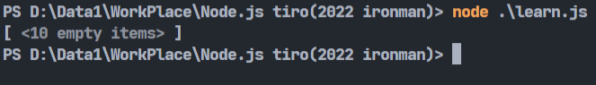
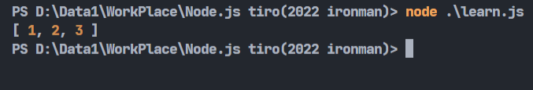
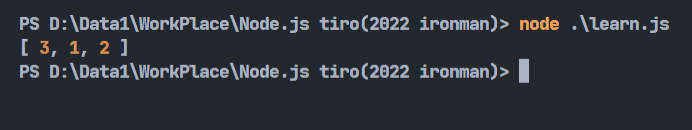
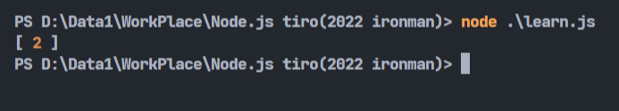
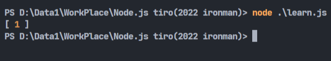
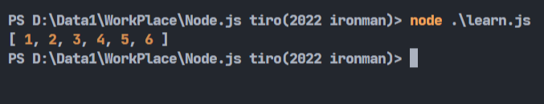
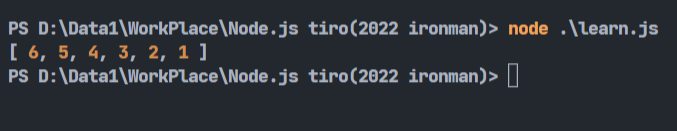
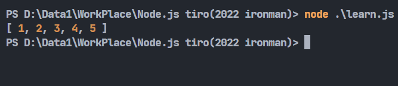
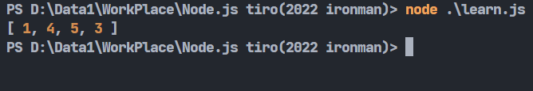

# Day10-JavaScript的陣列操作(上)

今天來講講陣列的基本操作，javascript建立陣列的方法很簡單，只要使用`[]`就能建立空陣列:

```javascript
let array = [];
```
這是建立陣列最快的辦法，也可以直接建立非空陣列。還有一種做法是利用建構式`Array()`來建立陣列，像是這樣:

```javascript
let array2 = new Array();
```
用這種方式可以預先定義陣列的大小，只要在`()`裡面輸入大小就好:

```javascript
let array2 = new Array(10);
console.log(array2)
```



不過用第一種寫法會比較方便，所以之後都會用第一種寫法。

再來，我們可以向陣列中加入東西，這邊可以用到`push()`這個函式:

## push()

`push()`專門用來加入資料到陣列中，它會將資料放到陣列的最後面:

```javascript
let array = [1,2];
array.push(3);
console.log(array);
```



剛剛提到這個做法用來將資料放到陣列的最後面，當然也有放到最前面的，這個函式叫`unshift()`

## unshift()

```javascript
let array = [1,2];
array.unshift(3);
console.log(array);
```



能新增元素當然也能刪除元素，跟`unshift()`對應的函式就是`shift()`，用來移除陣列第一個元素:

## shift()

`shift()`的用法後面不需要放入參數:

```javascript
let array = [1,2];
array.shift();
console.log(array);
```



跟新增元素一樣，也有刪除最後的元素的。跟`push()`對應的是`pop()`

## pop()

`pop()`的用法後面也不需要放入參數:

```javascript
let array = [1,2];
array.pop();
console.log(array);
```



javascript也提供排序的函式，使用`sort()`就能將陣列內的元素排序。

## sort()

```javascript
let array = [5,6,3,2,1,4];
array.sort();
console.log(array);
```



`sort()`可以在裡面放入函式來修改排列規則:

```javascript
let array = [5,6,3,2,1,4];
array.sort((a,b) => b-a);
console.log(array);
```



這樣就能做到由大排到小了，解說起來有點複雜，詳細可以參考這篇[Array.prototype.sort()](https://developer.mozilla.org/zh-TW/docs/Web/JavaScript/Reference/Global_Objects/Array/sort)

若要將陣列整個反轉的話，可以使用`reverse()`

## reverse()

```javascript
let array = [5,4,3,2,1];
array.reverse();
console.log(array);
```



若要同時做到刪除陣列元素以及加入陣列元素的話，可以使用`splice()`來達成。

## splice()

`splice()`可以填入三個(或更多)參數，第一個是起始位置，第二個是刪除的元素數量，最後一個參數(包含之後)可以填入要新增的參數:

```javascript
let array = [1,2,3];
array.splice(1,1,4,5);
console.log(array);
```



像上面這個例子，就會從第二個位置(陣列起始位置是0)，刪除一個值(2)，並在當前位置新增4跟5這兩個值進去。總而言之，就是一個混了很多綜合功能的函式。

今天就先講到這裡，明天繼續吧剩下的一些實用功能講一講。