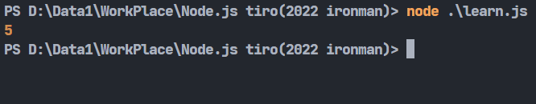
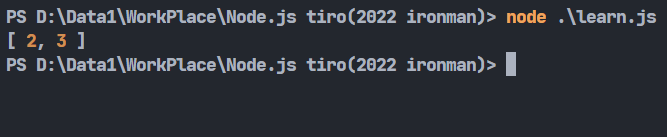

# Day11-JavaScript的陣列操作(下)

今天繼續來講昨天講了一部分的陣列操作，陣列操作的部分昨天講了基本的建立、新增以及刪除，還有綜合的用法。今天就繼續來講其他的用法。

## length

`length()`可以拿來查看陣列的長度，用法也很簡單:

```javascript
let array = [1,2,3,4,5];
console.log(array.length);
```



若不知道陣列的某個元素在哪個位置的話，可以使用`indexOf()`這個函式來尋找指定的值的位置:

## indexOf()、lastIndexOf()

這個函式可以帶入兩個參數，一般使用只會代入一個參數，也就是第一個參數-用來查詢的元素。若有第二個參數的話，會變成從第二個參數的位置開始尋找第一個元素。沒找到都會回傳-1。

```javascript
let array = [1,2,3,4,5];
console.log(array.indexOf(2));
console.log(array.indexOf(2,3));
```


第二行會搜尋2這個元素在陣列的第幾個位置，第三行則是從第三個位置開始找尋2這個元素，找不到所以回傳-1。

lastIndexOf()跟indexOf()是一樣的用途，只是他的判斷標準從由左到右變成由右到左而已。

## filter()

filter顧名思義就是拿來做分類用的，將指定陣列帶入後經由函式的條件來判斷，條件符合的會產出一個新的陣列:

```javascript
let array = [1,2,3,4,5];
console.log(array.filter(a => a > 2));
```


## findIndex()

這個函式會將陣列中的所有元素帶入函式，傳出第一個符合函式條件的值的位置:

```javascript
let array = [1,2,3,4,5];
console.log(array.findIndex(a => a > 2));
```


## join()

`join()`可以用來將陣列轉成字串，相比於toString()直接轉字串，它可以自定義分隔符號，預設為逗號:

```javascript
let array = [1,2,3,4,5];
console.log(array.join('/'));
```


## slice()

這個函式專門拿來擷取子陣列，放入開頭以及結束的參數，就能將父陣列的指定範圍內擷取出來:

```javascript
let array = [1,2,3,4,5];
let array2 = array.slice(1,3);
console.log(array2);
```


上面的例子就是將**array**這個陣列當成父陣列，從之中第一個元素(二)到第三個元素之前(四)，也就是2,3取出，作為子陣列顯示出來。

## map()

`map()`有點像是陣列專用的迴圈，陣列中的元素會被依序丟入函式中，做完函式中的事情後傳入到一個新的陣列中:

```javascript
let array = [1,2,3,4,5];
let array2 = array.map(a => a**2);
console.log(array2);
```


像上面的例子就是將陣列中的每個元素分別平方，之後在顯示出來。

## forEach()

`forEach()`跟上面的`map()`有點相似，直接看例子:

```javascript
let array = [1,2,3,4,5];
let a = 0;
array.forEach(arrayValue => a = a + arrayValue);
console.log(a);
```


可以看到上面的例子中，**arrayValue**這個變數會從陣列中取出元素來使用，並且加到**a**變數上。所以最後**a**的值就是陣列的所有元素相加。這種寫法在陣列的迴圈處理非常方便，可以寫出比較簡潔的程式碼。

## includes()

這個函式跟上面的indexOf()、lastIndexOf()很相似，只是差別在它只會告訴你這個元素是否存在，單純回傳true或false而已:

```javascript
let array = [1,2,3,4,5];
console.log(array.includes(5));
console.log(array.includes(1,3));
```


陣列的部分就先講到這裡，還有很多不常見的用法，反正用到就會記得了(?)。明天會來講解字串的操作部分。