# Day12-JavaScript的字串操作

今天來講講另一個資料型態-字串的基本函式，字串在創建的時候十分簡單，只要用`''`或`""`包起來就會成為一個字串。接下來就來介紹字串。


先來講一個字串以及變數組合顯示的功能吧!在ES6中出現了一個方法可以用更精簡的寫法來將變數插入字串中顯示出來:

```javascript
let a = 10;
console.log(`A is ${a}`)
```

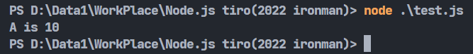

我們可以利用反引號來取代單(雙)引號，在之中用`{}`包住變數並在前面加入`$`，這樣就類似於python的f字串，讓字串顯示可以以比較漂亮的寫來實作。接下來來看看有甚麼比較常用的字串功能吧:

## length

跟陣列一樣，我們可以使用length來查詢指定字串的長度:

```javascript
console.log("abcdef".length);
```

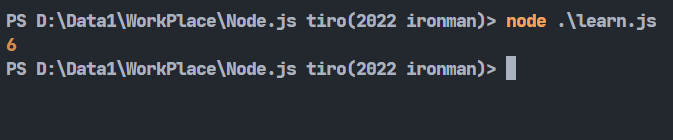

## slice()

slice()的用法也跟前面陣列一樣，放入開始以及結束參數，取得子字串:

```javascript
console.log("abcdef".slice(2,4));
```

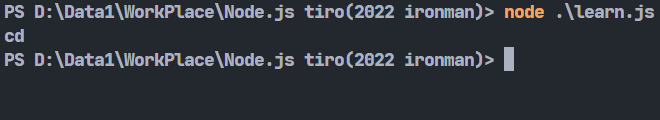

## replace()

replace()用來替換特定位置的字元，由需要改變的字串以及要改變成的字串組成，也可以利用正規表達式來表示要改變的字串。

```javascript
let string = "abcdef";
string = string.replace("abc","yyy");
console.log(string);
```

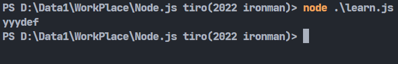

要特別注意的是，這個函式並不會更動原本的字串，所以必須將他丟到一個變數中，當然也可以用原本的變數接。

## match()

match()用來查詢指定字串是否存在，若存在會回傳一個陣列描述其資訊，不存在的話會回傳**null**，跟replace()一樣可以使用正規表達式。

```javascript
let string = "abcdef";
console.log(string.match("abc"));
console.log(string.match("cba"));
```

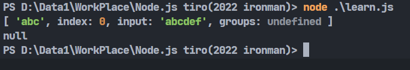

可以使用陣列的方式查詢字串出現的位置:

```javascript
let string = "abcdef";
console.log(string.match("abc")["index"]);
```

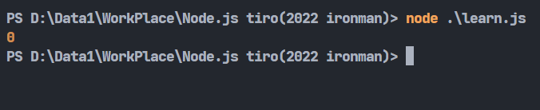

不過有個專用函式可以做到這件事，那就是search():

## search()

```javascript
let string = "abcdef";
console.log(string.search("abc"));
```


## indexOf()、lastIndexOf()

這兩個函式跟陣列的使用方式一模一樣，這邊就不多講了:

```javascript
let string = "abcdef";
console.log(string.indexOf("ab"));
console.log(string.indexOf("ab",3));
```

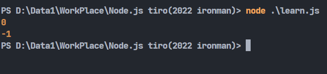

## charAt()

這個函式用來取得字串中特定位置的字元，若指定位置超出字串長度就會傳回空字串:

```javascript
let string = "abcdef";
console.log(string.charAt(3));
console.log(string.charAt(15));
```

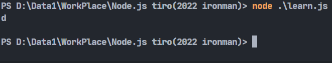

若要取得不只一個字元的話，除了使用剛剛的slice()外，還可以使用substr():

## substr()

這個函式跟slice()十分相似，差異在slice()的參數為開始及結束，substr()的參數為開始以及長度，下面舉了兩者差異的例子:

```javascript
console.log("abcdef".substr(2,3));
console.log("abcdef".slice(2,3));
```

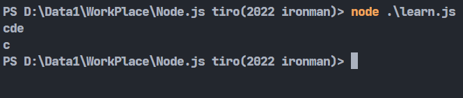

上面例子中，substr()是由第二個位置開始，長度為三，slice()是由第二個位置開始，到第三個位置。

## split()

split()用來分割字串，放入的參數為分割字串以及次數，利用分割字串將字串分割為多個字串後，根據次數選擇要保留幾個字串並以陣列的形式回傳。

```javascript
let string = "a b c d e"
console.log(string.split(" ",3));
```

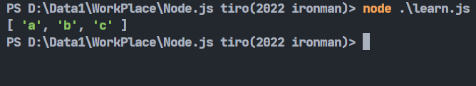

## concat()

有分割字串就有組合字串，concat()就是專門做這件事情的函式。參數也很簡單，丟入想要接在目標後面的字串就好，丟入的參數量沒有限制。

```javascript
let string = "abc"
console.log(string.concat("def","ghi"));
```

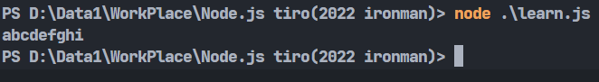

要注意的是這個函式也不會改變原本的值，所以要使用的話還需要用另一個變數接。

這樣就大致講完一些比較常用的字串功能了，明天繼續來講講別的。