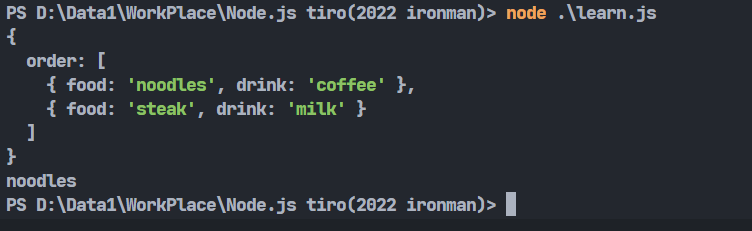
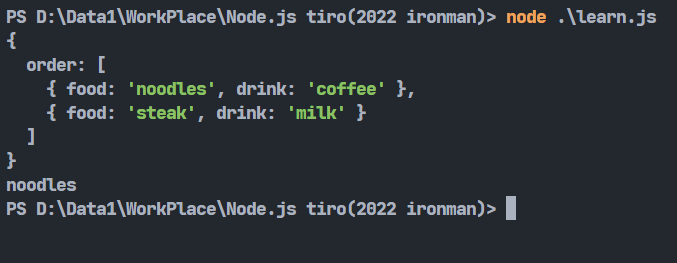

# Day13-JSON基本介紹

今天來講一下跟JavaScript密不可分的一種**資料交換格式**-**JSON**。

## JSON介紹

先來講講這東西到底是甚麼，就如同剛剛所說的，它是一種**資料交換格式**，顧名思義，為了方便資料在不同環境下進行使用，需要一個通用的格式或者說標準去規範，因此就有JSON的誕生。

JSON剛開始由JavaScript的語法衍生出來所以才叫做JSON(JavaScript Object Notation)，基本上大部份的語言都有支援JSON的轉換與讀取。JSON最早被用於WEB開發，到現今一些NOSQL資料庫的崛起(像是Firebase)，也會使用JSON作為資料儲存格式。

## JSON語法

JSON的構成主要為下列這三個部分，分別是基本資料、物件、陣列。

JSON的基本資料還蠻好表達的，利用`:`隔開鍵跟值，像是下面這樣:

```JSON
"food":"noodles"
```

多個資料可以組成一個物件，每個物件用`,`隔開，再用`{}`包起來:

```JSON
{
    "food":"noodles",
    "drink":"coffee"
}
```

陣列型態就跟大部份程式語言一樣，用`[]`包住，之間的每個物件要用`,`隔開:

```JSON
{
    "order":[
        {"food":"noodles","drink":"coffee"},
        {"food":"steak","drink":"milk"}
    ]
}
```

## 轉換JSON的方式

除了直接讀取.json檔案以外，只要格式符合JSON的標準的話，我們就可以將符合JSON的標準的字串轉換成JavaScript物件來做使用，有點像字串轉陣列的感覺。

我們可以利用JSON.parse()這個內建函式來將JSON轉換為javascript物件:

```javascript
let json = '{"order":[{"food":"noodles","drink":"coffee"},{"food":"steak","drink":"milk"}]}';
let jsObject = JSON.parse(json);
console.log(jsObject);
console.log(jsObject["order"][0]["food"]);
```



這樣就可以用物件的方式(陣列)存取了。也可以不用字串，單純用JSON的方式去讀取，但這時候就要先轉換為字串，這邊就會用到JSON.stringify()去轉換為字串:

```javascript
let json = {"order":[{"food":"noodles","drink":"coffee"},{"food":"steak","drink":"milk"}]};
let jsObject = JSON.parse(JSON.stringify(json));
console.log(jsObject);
console.log(jsObject["order"][0]["food"]);
```



參考資料: [https://www.w3schools.com/js/js_json.asp](https://www.w3schools.com/js/js_json.asp)