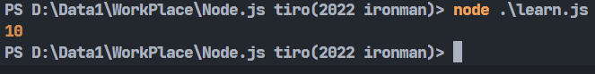
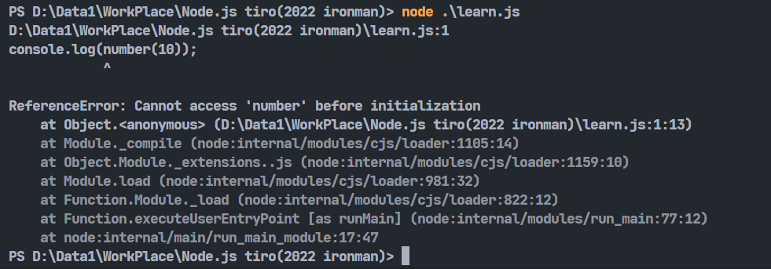
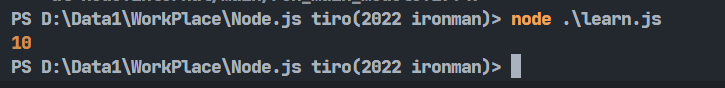

# Day14-淺談陳述式以及表達式

在javascript中，可以將寫出來的程式碼大致分為陳述式以及表達式。今天這篇文我會整理幾個自己在學時覺得比較重要的陳述是以及表達式的重點。

## 陳述式

陳述式英文叫做Statement，這種句子會達成某些事情，**但並不會產生數值**。javascript中的陳述式主要有下列這些:


* let、var、const變數宣告
* if...else條件判斷
* switch條件判斷
* for迴圈
* while迴圈

可以看到這些語句都會進行某些事情，但並不會產生數值。

## 表達式

表達式也叫做Expression。表達式就不一樣了，**表達式會產生數值**，所以只要語句能產生數值，基本上它就會是表達式。表達式也被稱為運算式，有用到運算子大多都會是運算式，之前有寫一篇是專門講運算子的，忘記那是甚麼的可以回去複習一下。

所以就如同上面所說，能產生數值就會是表達式，表達式可以大致分為兩種，一種是將值指定給一個變數，另一種則是單純取得值的語句，下面舉一點簡單的例子:

* a = 10
* 2 * 5
* 3
* true || fasle
* 'IT邦' + '鐵人賽'
  
上面這幾種都是表達式，第一個就是將值指定給一個變數的例子，其餘的例子都能取得一個值的語句，所以都屬表達式的範疇。

## 函式陳述式

剛剛有提到陳述式中有個例子是變數宣告，將函式以宣告的方式得到的函式就可以被稱為函式陳述式。根據[MDN](https://developer.mozilla.org/zh-TW/docs/Glossary/Hoisting)上的說法，函式陳述式的好處在於在執行程式碼之前，JavaScript會把函式宣告放進記憶體裡面，這樣就能在程式碼執行到該函式之前就使用它，這個行為也被稱為提升（Hoisting），直接來看例子:

```javascript
console.log(number(10));

function number(result) {
    return result;
}

```



可以看到這樣也能在還沒執行到函式的程式碼時使用函式。

## 函式表達式

函式表達式就是使用將值指定給一個變數的原則來將函式指定到一個變數上使用，這樣的寫法函式就不會有Hoisting，因此剛剛的寫法就會有問題:

```javascript
console.log(number(10));

let number = function(result) {
    return result;
}
```



它會跟你說找不到此變數，因為還沒執行到就先呼叫了，這時候就只能將函式寫在前面:

```javascript
let number = function(result) {
    return result;
}

console.log(number(10));
```



參考資料: [https://developer.mozilla.org/zh-TW/docs/Glossary/Hoisting](https://developer.mozilla.org/zh-TW/docs/Glossary/Hoisting)