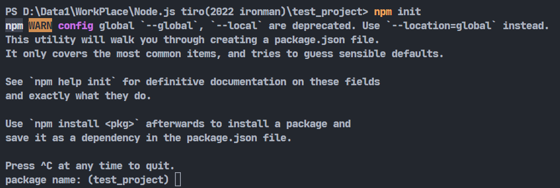
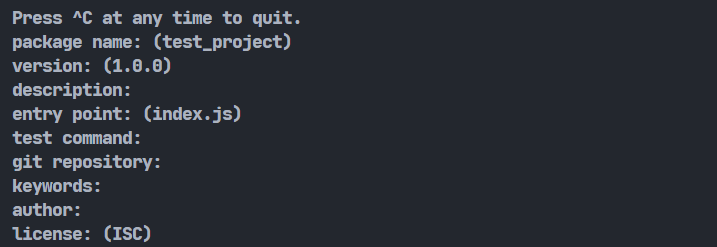
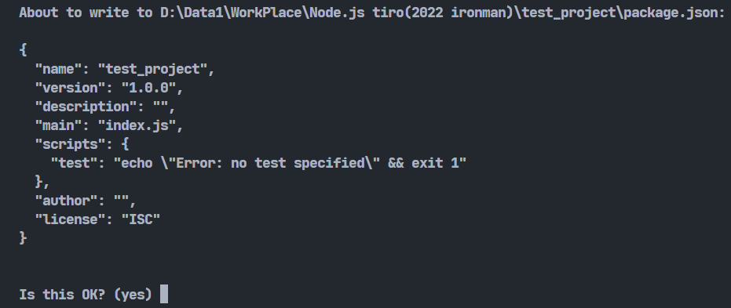
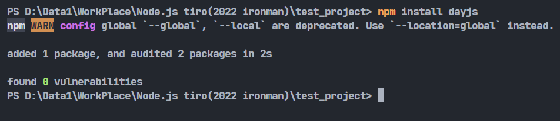
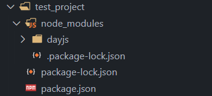
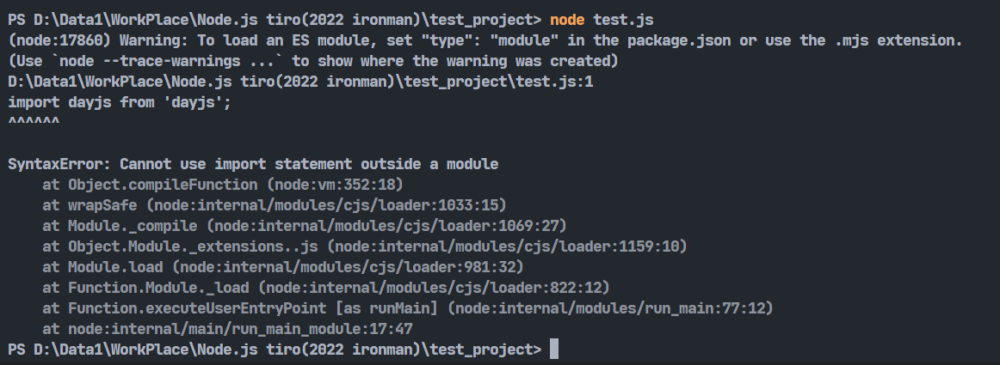
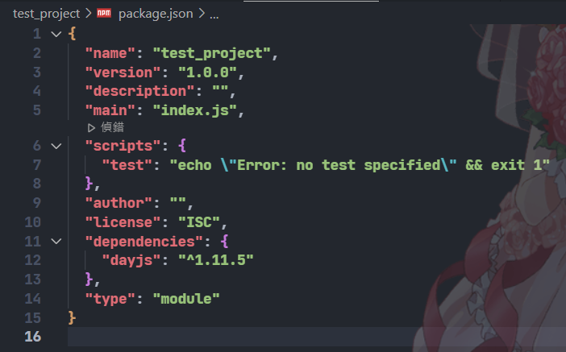
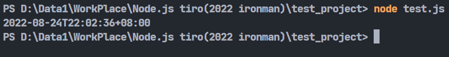
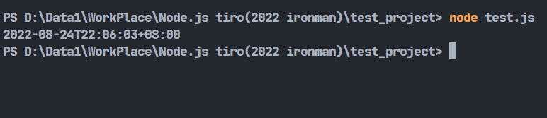

# Day15-npm基本介紹及使用

前面補充了很多天的javascript基本語法，今天，終於要來回到Node上面的部分了!先來介紹NPM以及講解它如和使用吧!

## NPM是甚麼

NPM全名為 **node package manager**，顧名思義，它是node的套件管理工具，是專門讓開發者可以使用一些第三方的套件來協助開發專案的工具。

還記得當初Day3在安裝node時，最後的確認安裝有輸入一個npm -v的指令嗎，那指令就是用來查詢電腦安裝的npm版本用的。

## NPM專案建立以及套件安裝

NPM的套件是跟著專案跑的，所以剛開始我們需要先建立一個專案。先建立一個資料夾，進入後開啟cmd(終端機)，輸入指令:

```bash
npm init
```



再來會詢問一些基本資料，若沒特別要填寫的話可以按enter略過:





最後就直接enter，可以看到他會幫你建立一個package.json的檔案，這個檔案用的格式就是前幾天講的JSON格式，它會記錄這個專案的所有套件的版本資訊等。

若中途的設定沒什麼必要調整的話，也可以直接使用`npm init -y`來快速初始化。

再來就是安裝套件了，這邊我隨便挑個套件來做測試，輸入以下指令就能進行安裝，這邊使用`dayjs`套件作為舉例:

```bash
npm install '套件名稱'
```

可以去[官方網站](https://www.npmjs.com/)搜尋想使用的套件。



可以看到旁邊多出了一個資料夾-node_modules，裡面會存放著對應資料夾的套件。



## NPM套件的使用

再來就是使用套件了，先建立一個js檔案，我們可以使用import指令來導入剛剛安裝的套件:

```javascript
import dayjs from 'dayjs'; //引入套件

console.log(dayjs().format()); //使用套件
```



寫好程式後執行發現報錯，爬文才查到說import是ES6語法，若要啟用這個語法的話，要去package.json中新增`"type": "module"`這行:



加完後再執行一次程式:



就能看到成功使用套件了!這個問題也能使用require語法來解決，就不需要修改package.json了:

```javascript
const dayjs = require('dayjs'); //引入套件

console.log(dayjs().format()); //使用套件
```



dayjs這個套件是專門做時間處理的套件，有十分輕量等優點。之後會專門介紹它。