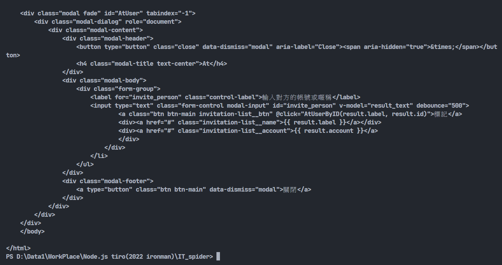
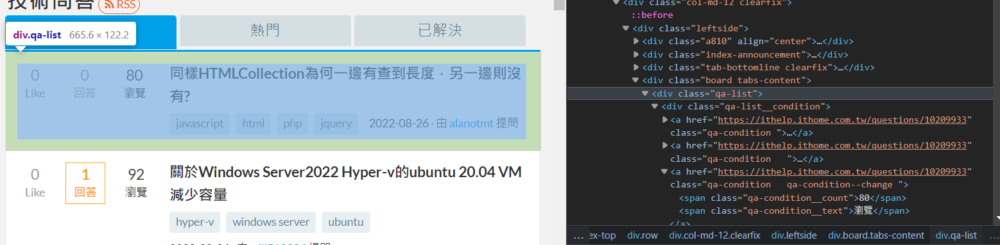
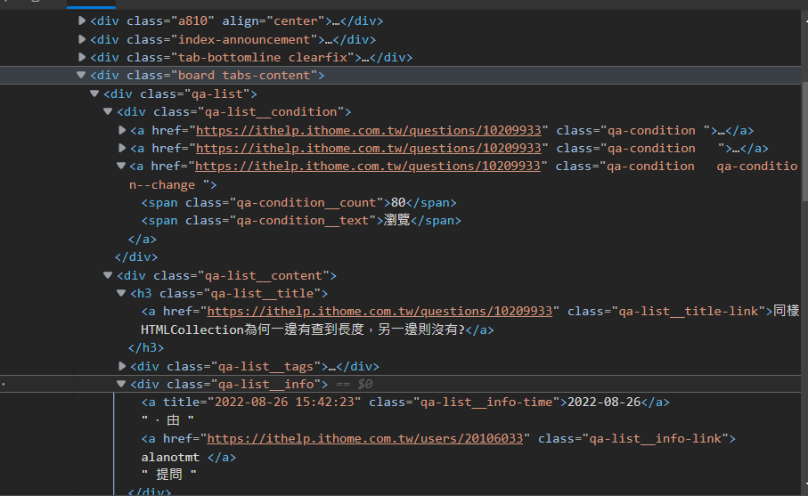
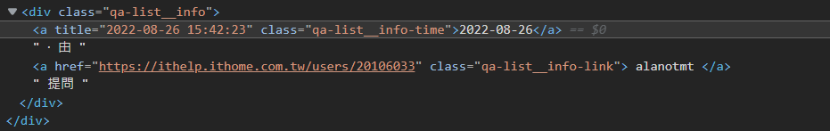
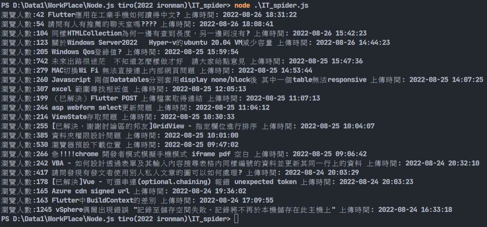

# Day16-利用JavaScript進行爬蟲吧!

今天就來使用Node.js進行爬蟲吧，這邊會用到兩個套件。先創建專案，並且安裝這兩個套件:

```bash
npm install request
npm install cheerio
```

這個cheerio就是我們今天的主角。如果有看過我去年的鐵人賽可以看到，在使用Python爬蟲時，beautifulsoup提供了CSS Selector等分析網頁原碼的方式，在JavaScript中，jQuery是這方面最方便的函式庫，而在Node.js上能實現jQuery功能的套件庫就是我們今天的主角-cheerio。那request又是幹嘛的呢，丟給cheerio處理的資料的取得方式，就要用到request了，這個套件會送出請求給網頁來取得HTML原碼。

再來就開始實作好了，一樣先來個最基本的題目-爬取IT邦的問答標題等內容。起手式先把套件引入，並且先把網址給記錄下來。等等要當作參數餵給request:

```javascript
const request = require('request');
const cheerio = require('cheerio');

const url = 'https://ithelp.ithome.com.tw/questions';
```

再來將架構建構出來，request中第一個參數放入網址，第二個參數放入一個函式，這個函式就是我們爬蟲用的函式，裡面放入三個基本參數，並且用判斷式判斷若有發生錯誤的話，就將錯誤丟出來，沒有錯誤的話才執行爬蟲程式。然後先將整個HTML頁面顯示出來:

```javascript
import request from "request";
import cheerio from "cheerio";

const url = 'https://ithelp.ithome.com.tw/questions';

request(url, function(error, response, body){

    if (!error){
        console.log(body);
    } 
    else throw new Error(error);
});
```



若能看到密密麻麻的網頁原碼應該就是沒問題了。

再來就可以進行網頁分析了，我們打開IT邦的首頁，對第一篇文章點右鍵檢查:



可以看到每篇文章都是由一個div，class名稱為qa-list的區塊所組成的，所以我們要針對這個區塊做爬取，把if區塊中的程式碼改成這樣:

```javascript
let $ = cheerio.load(body);
let data = $(".qa-list");
```

跟JQuery的寫法基本一樣，利用`$`以及cheerio.load來讀取request取得的HTML原碼(剛剛request中的函式的第三個參數body就是用來存取整個網頁資料)，然後利用class的選擇方法選擇qa-list這個區塊。

寫到這邊可以增加一行`console.log(data.html())`來看有沒有爬到東西，不過這樣的話會發現它只會爬取第一筆資料，所以我們需要進行迴圈爬取，將所有qa-list中的資料一筆一筆的爬出來。這邊可以使用JQuery提供的each()來解決問題:

```javascript
let $ = cheerio.load(body);

let data = $(".qa-list");

data.each(function(index, value){
});
```

each()內的函式有兩個參數，前面的參數是索引值，後面的參數是爬到的值，每一次迴圈都會爬到下一筆qa-list的值，所以我們可以利用這個方式再將qa-list拆成不同區塊。我想爬的分別是瀏覽人數、標題以及上傳時間，再回去看一下HTML的細部:



這樣就可以很清楚看到想要的資料分別在哪了，開始撰寫程式碼，在each()的函式內加入以下程式碼:

```javascript
let $ = cheerio.load(value);
let browse = $(".qa-condition.qa-condition--change .qa-condition__count");
let title = $(".qa-list__title-link");
let time = $(".qa-list__info-time");
```
迴圈爬取到的每個qa-list值進來each迴圈後會再被load一次，這時就能拆成三個部分，瀏覽人數的class名稱為.qa-condition qa-condition--change下的.qa-condition__count，所以將這兩個class名稱放進去，用空格格開，這邊要注意的點是前面的class名稱有空格，所以會被認為是qa-condition下的qa-condition--change，這時候只要將空格替代成`.`就好了。再來是標題，標題就蠻簡單的，他就在qa-list__title-link標籤內，直接爬就好了。最後是上傳時間，可以由下圖看到上傳時間在qa-list__info-time裡面:



而又以標籤元素的title更為精細，所以等等可以使用attr功能去爬取title內的值。

這樣就能迴圈爬取資料了，接下來就只要將輸出整理就好了。直接看程式碼:

```javascript
console.log(`瀏覽人數:${browse.text()} ${title.text().trim()} 上傳時間: ${time.attr("title")}`);
```

這邊利用`$`以及`{}`來將字串以及變數做連接，可以看到瀏覽人數以及標題都加上了text()函式，這個函式用來將夾在標籤中的文字輸出，也就是說他會清除掉HTML標籤。標題又加上了trim()函式用來清除前後空白，最後的時間使用了attr函式取出放在title屬性中比較精確的時間:



也可以將資訊組織好並建立JSON文件存起來之類的，有很多會使用到資料的地方，所以我覺得爬蟲算是程式設計必修課之一。附上完整程式碼:

```javascript
const request = require('request');
const cheerio = require('cheerio');

const url = 'https://ithelp.ithome.com.tw/questions';

request(url, function(error, response, body){

    if (!error){
        let $ = cheerio.load(body);

        let data = $(".qa-list");
        data.each(function(index, value){
            let $ = cheerio.load(value);
            let browse = $(".qa-condition.qa-condition--change .qa-condition__count");
            let title = $(".qa-list__title-link");
            let time = $(".qa-list__info-time");
        console.log(`瀏覽人數:${browse.text()} ${title.text().trim()} 上傳時間: ${time.attr("title")}`);
        });
    } 
    else throw new Error(error);
});
```