# Day17-使用內建fs模組進行檔案操作吧!

今天會來介紹一個叫做**fs**的Node模組，這個模組可以進行檔案操作，有點像是python的os模組，在需要進行大量的檔案操作時，可以藉由這個套件來撰寫程式，簡化人力操作。這個套件是內建的，直接require就好(或import):

```javascript
const fs = require('fs');
```

接下來就來看看這些套件可以做到甚麼吧!

## 創建資料夾-fs.mkdir()

我們可以利用fs.mkdir()來創建資料夾，用法很簡單，參數的部分可以放入三個參數分別是path、mode以及callback，mode會用來設定資料夾的權限，基本上很少用到，path我們可以輸入當前路徑，callback通常會用來告知有無錯誤或用來告知資料夾創建成功:

```javascript
const fs = require('fs');

let dir = 'Test';

fs.mkdir(`./${dir}`, (err) => {
    if(!err) console.log(`資料夾${dir}創建成功!!!`);
    else throw new Error(err);
});
```
  
我先將資料夾名稱用一個變數儲存，再利用函式創建。這邊我的路徑使用相對路徑，絕對路徑也是可以的。

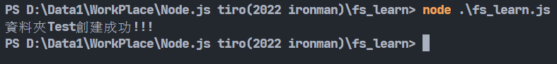

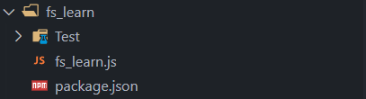

可以看到資料夾就被創建出來了。

## (創建)寫入檔案-fs.writeFile()

創建檔案可以使用的fs.writeFile()，這是用來寫入資料的函式，當目標檔案不存在時就會創建檔案。參數有file、data、options、 callback四個，file跟前面的path一樣都是路徑，data是寫入的資料，options則是encoding(編碼模式)，mode以及後面會講到的flags的集合，這個參數跟前面的mode一樣是可選的。

```javascript
const fs = require('fs');

let dir = './Test/test.txt';
let data = 'Hello world!'

fs.writeFile(dir, data, (err) => {
    if(!err) console.log('創建檔案成功!!!');
    else throw new Error(err);
});
```
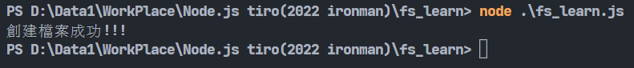

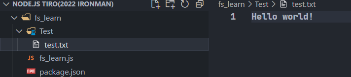

這樣就能創建檔案並寫入資料了喔!

## 讀取檔案-fs.readFile()

fs.readFile()用來讀取檔案，這個函式有四個參數，分別是path、options以及callback，path跟前面一樣，比較特殊的是剛剛沒講到的options中的flags，flags用來選擇**讀取檔案的模式**，[geeksforgeeks](https://www.geeksforgeeks.org/node-js-fs-open-method/)上有蠻完整的表格，分別告訴你不同模式代表的意思:

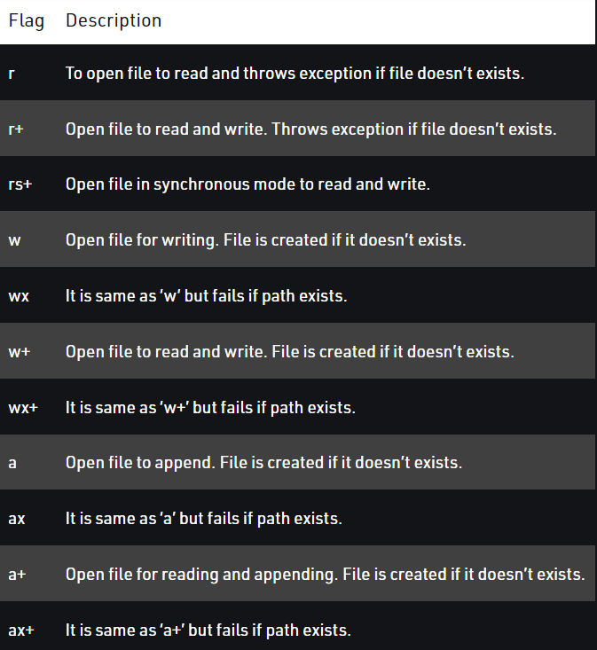

fs.readFile()的callback有兩個參數，除了err錯誤外，還有data這個參數，也就是讀取檔案內的資料:

```javascript
const fs = require('fs');

let dir = './Test/test.txt';

fs.readFile(dir, [flag = 'r'], (err, data) => {
    if(!err) console.log(data.toString());
    else throw new Error(err);
});
```

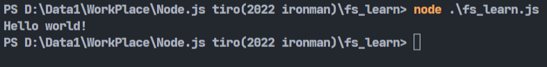

可以看到這樣就可以用r模式讀取檔案的值了。

## 更改檔案名字-fs.rename()

我們也可以利用fs.rename()來更改檔案名稱，分別有三個參數oldPath、newPath、callback，oldPath以及newPath顧名思義是舊路徑以及新路徑，直接看例子:

```javascript
const fs = require('fs');

let oldPath = './Test/test.txt';
let newPath = './Test/newTest.txt';

fs.rename(oldPath, newPath, (err) => {
    if(!err) console.log("改名成功");
    else throw new Error(err);
});
```

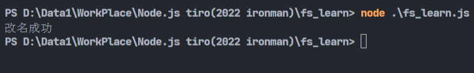

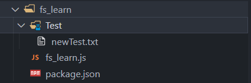

## 刪除檔案-fs.unlink()以及刪除資料夾-fs.rmdir()

fs.unlink()用來刪除檔案，只有兩個參數，分別是path，也就是刪除的檔案路徑以及callback-回傳函式，如果我要刪除剛剛的newTest.txt的話，我可以這樣寫:

```javascript
const fs = require('fs');

let path = './Test/newTest.txt';

fs.unlink(path, (err) => {
    if(!err) console.log("刪除檔案成功");
    else throw new Error(err);
});
```

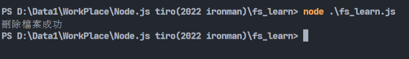

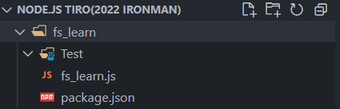

fs.rmdir()用來刪除資料夾，參數一樣有三個-path、options以及callback，這邊的options的功能是在刪除料夾時的細節，也是可選參數，有maxRetries、recursive跟retryDelay，詳細可以看[官網](https://nodejs.org/api/fs.html#fsrmdirpath-options-callback)，像是若我要刪除剛剛的Test資料夾，我可以這樣寫:

```javascript
const fs = require('fs');

let path = './Test';

fs.rmdir(path, (err) => {
    if(!err) console.log("刪除資料夾成功");
    else throw new Error(err);
});
```

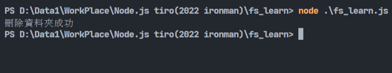

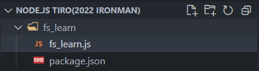

## 同步檢查路徑是否存在-fs.existsSync()

這個函示會用同步的方式檢查路徑上的指定檔案(或資料夾)是否存在，存在就回傳true，否則就回傳false。參數為要檢查的路徑，整體用起來還還蠻直覺的:

```javascript
const fs = require('fs');

fileExists1 = fs.existsSync('./z.txt');
fileExists2 = fs.existsSync('./y');
fileExists3 = fs.existsSync('./x.txt');

console.log(fileExists1);
console.log(fileExists2);
console.log(fileExists3);
```
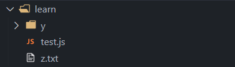

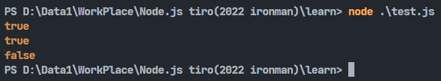

這些函式其實就很夠用了，其他像是fs.open()或是fs.close()、fs.read()等等的方式基本上跟readFile的重複性太高，等後面不得已需要用到時再補充，明天應該會利用這個套件結合爬蟲套件來做到下載圖片的程式。