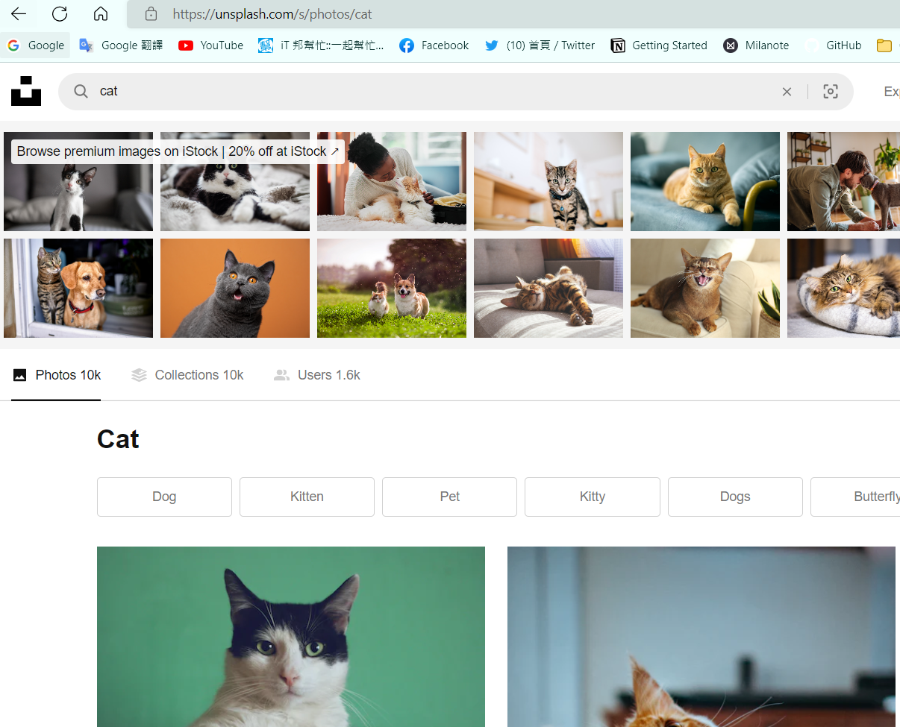
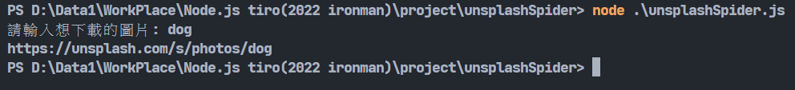
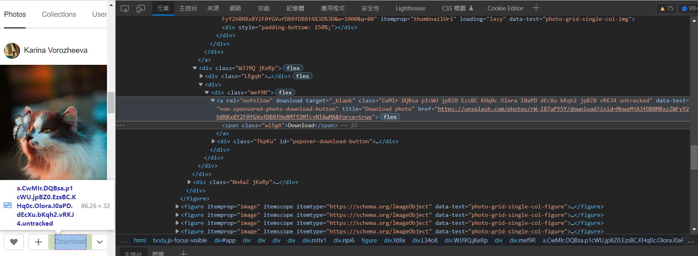
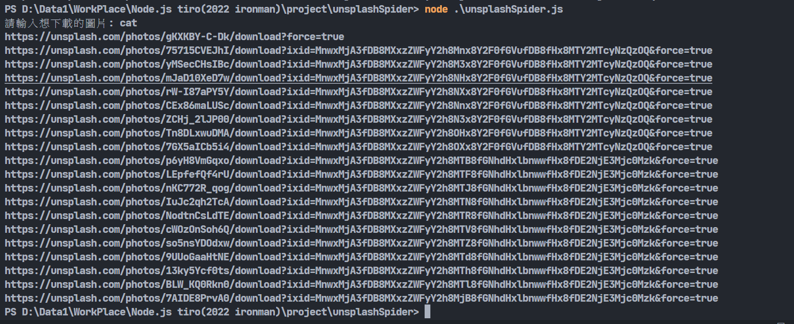
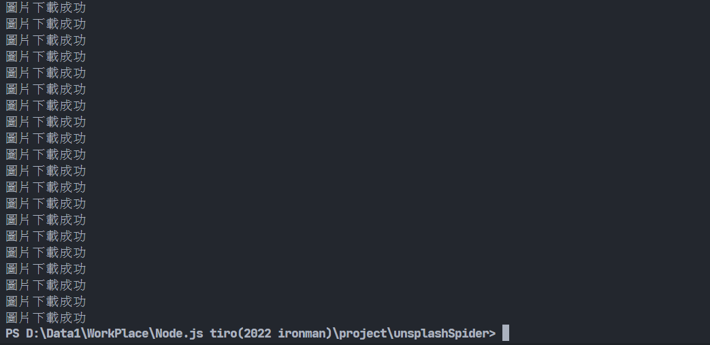
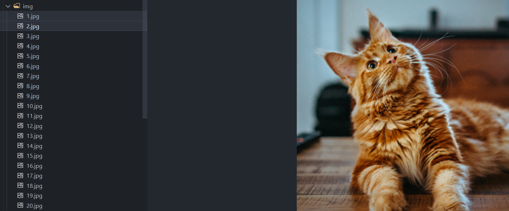

# Day18-回來寫爬蟲吧!下載圖片實戰

今天就回來寫爬蟲吧，我們要利用cheerio以及fs來做到爬圖片的功能。這次會跟去年一樣會拿**unsplash**這個網站做示範。

起手式當然是先建立專案，引入套件，這應該不用多說了:

```javascript
const request = require('request');
const cheerio = require('cheerio');
const fs = require('fs');
const readline = require('readline').createInterface({
    input: process.stdin,
    output: process.stdout
})
```
我們可以用**readline()**這個模組來讀取使用者訊息，它一樣是內建的套件。這時候先來看看目標網站的網址的部分:



可以看到輸出甚麼文字就會在網址後面加上甚麼文字，可以利用這點讀取使用者輸入進而修改網址，下載使用者想要的圖片:

```javascript
readline.question('請輸入想下載的圖片: ', (img) => {
    const url = `https://unsplash.com/s/photos/${img}`;
    console.log(url)
    readline.close();
})
```

可以先看一下網址是否正確:



看起來沒什麼問題，那再來就要來分析網頁原碼了，打開網頁，右鍵點擊圖片檢查:



可以看到每張圖片的Download按鍵上會有一個網址，按下去會下載圖片。看來這就是圖片資源的所在之處了，我們要將這個網址的資源拿到手，將程式碼改成這樣:

```javascript
readline.question('請輸入想下載的圖片: ', (img) => {
    const url = `https://unsplash.com/s/photos/${img}`;
    request(url, function(error, response, body){

        if (!error){
            let $ = cheerio.load(body);
    
            let data = $(".CwMIr.DQBsa.p1cWU.jpBZ0.EzsBC.KHq0c.Olora.I0aPD.dEcXu.bKqh2.jpBZ0.vRKJ4.untracked");
            data.each(function(index, value){
            console.log(`${$(value).attr('href')}`);
            });
        } 
        else throw new Error(error);
    });
    readline.close();
})
```

基本上跟之前的寫法一樣，我們先抓到每張圖片網址的位置，也就是data那一長串，在將它的href屬性抓出來，這個部分就是每張圖片的網址。程式直接跑起來做測試:



密密麻麻的網址，每個網址都是一張照片，點進去都能下載。找到了照片的所在地後，就要開始進行下載了。下載的邏輯很簡單，利用request套件獲取每個網址的資源(圖片本體)，再將這些資源利用fs套件寫入到本地檔案中，也就是說，我們將網路上圖片的資料存取下來，複製到電腦上的空檔案中。

還記得昨天的fs嗎，fs有許多寫入檔案的方法，但因為今天要從網路上寫入，這邊用到一個叫做Stream的概念，它能將檔案拆成許多小區塊做讀寫，可以提高讀寫的效率。這個特殊的東西當然也有專門的函式，那就是fs.createWriteStream()。修改一下程式碼:

```javascript
let filename = 1;
data.each(function(index, value){
    console.log(`${$(value).attr('href')}`); //顯示URL
    let stream = fs.createWriteStream(`./img/${filename.toString()}.jpg`);
    request($(value).attr('href')).pipe(stream);
    stream.on('finish', ()=>{ console.log('圖片下載成功'); });
    filename++;
    
});
```

我新增了一個變數用來當作檔名，並且利用fs.createWriteStream()的方式建立檔案，再用request函式接到每個網址的內容，藉由pipe()這個語法將資料讀入檔案，最後利用on()這個功能告知使用者下載的進度，然後要記得讓filename更改，才不會檔名衝到。再來不要忘記.img這個資料夾的建立，所以再前面加入fs.mkdir函式:

```javascript
 fs.mkdir(`./img`, (err) => {
        if(!err) console.log('資料夾img創建成功!!!');
        else if(fs.existsSync(`./img`));
        else throw new Error(err);
});
```

這邊用前面學到的fs.existsSync()來判斷資料夾是否存在，若存在就不用再建立了，不然會報錯。再來就來看成果吧!






附上最終程式碼:

```javascript
const request = require('request');
const cheerio = require('cheerio');
const fs = require('fs');
const readline = require('readline').createInterface({
    input: process.stdin,
    output: process.stdout
})

readline.question('請輸入想下載的圖片: ', (img) => {
    fs.mkdir(`./img`, (err) => {
        if(!err) console.log('資料夾img創建成功!!!');
        else if(fs.existsSync(`./img`));
        else throw new Error(err);
    });
    const url = `https://unsplash.com/s/photos/${img}`;
    request(url, function(error, response, body){
        if (!error){
            let $ = cheerio.load(body);
            let data = $(".CwMIr.DQBsa.p1cWU.jpBZ0.EzsBC.KHq0c.Olora.I0aPD.dEcXu.bKqh2.jpBZ0.vRKJ4.untracked");
            let filename = 1;
            data.each(function(index, value){
                console.log(`${$(value).attr('href')}`); //顯示URL
                let stream = fs.createWriteStream(`./img/${filename.toString()}.jpg`);
                request($(value).attr('href')).pipe(stream);
                stream.on('finish', ()=>{ console.log('圖片下載成功'); });
                filename++;
                
            });
        } 
        else throw new Error(error);
    });
    readline.close();
})

```