# Day19-使用DayJS來操作時間(上)

前面在測試npm套件的時候，有用到的一款套件來做測試，這個套件叫做DayJS。DayJS是用來對時間進行操作的套件，只要有關於時間，你就能看到DayJS的影子。

```bash
npm install dayjs
```

```javascript
const dayjs = require('dayjs');
```

引入套件後，看看[官網](https://day.js.org/en/)上有甚麼比較常用的功能吧!

## Parse

官網的Parse分類提供了多基本的解析方法。先來看看如何創建一個新的Day.js物件:

```javascript
let currentTime = dayjs();
console.log(currentTime.format());
```

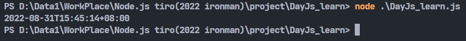

dayjs()不帶參數會建立當前時間的Day.js物件。可以利用format()做格式化，顯示出來的格式會比較好看。

我們也可以將字串照著格式解析成Day.js物件，具體用法如下:

```javascript
let time = dayjs("2022-08-31", "YYYY-MM-DD")
console.log(time.format())
```

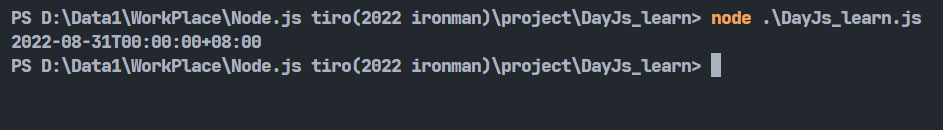

可以藉由官方給的表格，來將字串照著格式解析成Day.js物件，下方是官方的表格:

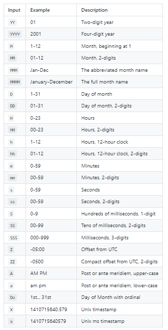

第二個參數也就是格式可以同時有很多種的狀況，假設我不知道當前格式是甚麼只知道它是特定幾種格式的其中一種，可以利用`[]`將可能的格式都寫進去:

```javascript
let time = dayjs("2022/08/31", ["YYYY-MM-DD","YYYY/MM/DD"])
console.log(time.format())
```

剛剛看到的都是本地時間，想獲取UTC(世界協調時間)，可以這樣寫:

```javascript
const utc = require('dayjs/plugin/utc');
dayjs.extend(utc);

console.log(dayjs.utc().format());
console.log(dayjs().format());
```

記得要引入utc並用extend()配置，不然會報錯。這樣可以清楚看到UTC時間跟本地時間的差異:

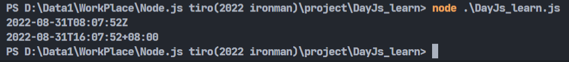

Dayjs物件可以利用clone()來複製:

```javascript
let currentTime = dayjs()
let currentTime_clone = currentTime.clone()
```

## Get + Set

Day.js可以用函式來設定時間等等的資訊，可以設定秒、小時、星期幾等資訊:

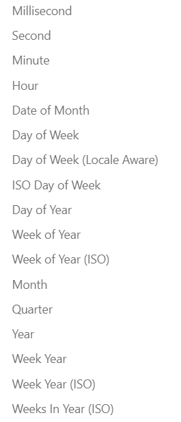

比較特別的是，在Day.js中，設定(set)以及取得(get)是一樣的函式，若有放參數就會是set，沒有就會是get。

```javascript
let time = dayjs().date(20);
console.log(time.date());
```

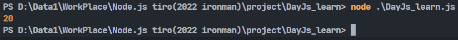

像是上面的例子我設定了date，放入參數20(也就是設定20號)，這時候我們用同一個函式但不放參數，結果就會取得剛剛設定的20號。

不過在取得特定資訊的部分有get()這個函式，可以直接使用這個函式取得指定資訊:


```javascript
console.log(`現在的毫秒數:${dayjs().get('millisecond')}`);
console.log(`現在的小時數:${dayjs().get('hour')}`);
```

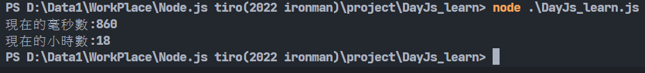

可以取得的資訊有下列這些:

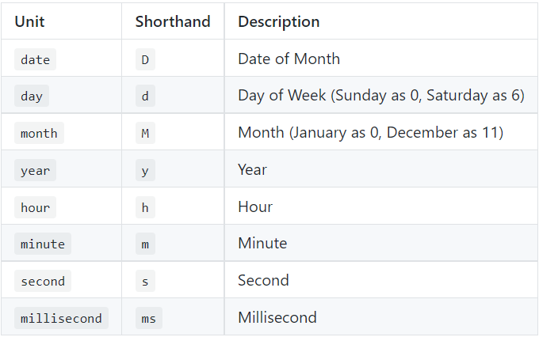

既然有get專門取得資訊，那當然也有set專門設定資訊:

```javascript
let time = dayjs().set('hour', 10).set('minute', 10).set('second', 10);
console.log(time.format());
```

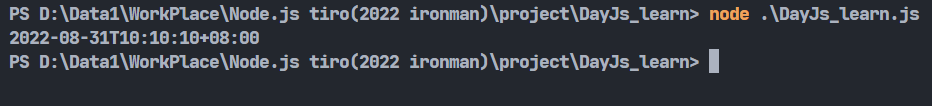

set()可以放兩個參數，分別是要設定的資訊以及值，而且可以接著使用，所以一次設定多種值就可以這樣串著使用。

max()、min()這兩個函式可以用來取得多個時間中的最大值以及最小值:

```javascript
const minMax = require('dayjs/plugin/minMax');
dayjs.extend(minMax);

console.log(dayjs.max(dayjs('2015-03-04'),dayjs('2022-08-31')).format());
console.log(dayjs.min(dayjs('2015-03-04'),dayjs('2022-08-31')).format());
```

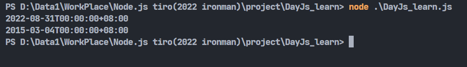

這兩個函式也需要額外引入，叫做minMax。

## Manipulate

這個分類大致看了一下，主要是對時間進行增減修改等的功能。

```javascript
console.log(dayjs().format());
console.log(dayjs().add(5, 'hour').format());
console.log(dayjs().subtract(7, 'minute').format());
```
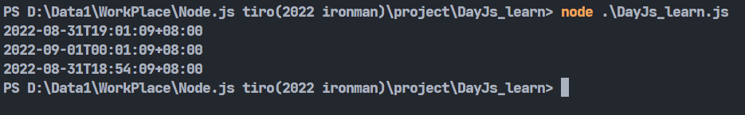

不同於前面的直接設置，這邊的add()跟subtract()分別是增加時間量以及減去時間量，第一個參數放時間量，第二個參數放要修改的資訊。可以修改的資訊如同剛剛上面的表格。

還記得剛剛的UTC時間嗎，若我想取得非本地時區的時間的話，除了手動用剛剛的add()、subtract()自己加以外，可以利用utcOffset()這個函式對UTC標準時間做手腳，像是如果我要的目標時間比UTC標準時間慢了四小時，就能這樣寫:

```javascript
const utc = require('dayjs/plugin/utc');
dayjs.extend(utc);

let time = dayjs().utcOffset(-4);
console.log(dayjs.utc().format());
console.log(time.format());
```

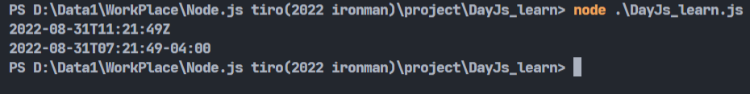

參考資料:https://day.js.org/en/

今天就先讀到這吧，第一次嘗試從官方文檔擷取重點，若有相關的建議歡迎提出。明天應該會繼續講Day.js，畢竟官方文檔真的很多(冏)。