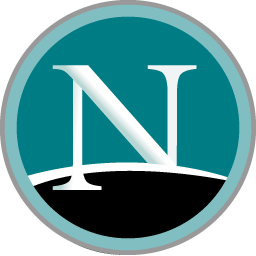

# Day-2 Node.js初步認識

要談到Node.js，我們首先要先認識js。js就是javascript，這個程式語言(或稱腳本語言)用途主要為給予網頁動態的內容，例如:動畫、訊息框、處理多媒體等，他也可以做到控制cookie，檢查瀏覽器資訊等。簡單來講，javascript對於網頁的製作是非常重要的一環，沒有javascript，你的網頁就只會是很單純的靜態頁面，沒辦法做到複雜的效果。

## JavaScript的歷史-他與Java的關係

JavaScript這個程式語言與另一款叫做Java的程式語言名稱十分相近，那他們之間到底有甚麼關係呢?

### 1990年代的網頁瀏覽器

在網頁瀏覽器剛開始普及時，當時最有名的瀏覽器為**Netscape Navigator**，開發這個瀏覽器的公司-**Netscape**當時想要用一個語言去幫助網頁設計師可以更輕鬆的組合各種外掛程式以及其他多媒體元件。當時Java剛準備在網頁上發光發熱，**Netscape**就打算發明一種與Java搭配使用的語言，JavaScript就這樣誕生了。

### 所以他與Java到底有甚麼關係?

除了有些語法上相似，以及當年的用途外，這兩個語言完全沒有任何的關係，JavaScript甚至原本根本不叫這個名字，從最初的**Mocha**到**LiveScript**，最後是因為要搭配上Java才再次改名為JavaScript。

## Node.js

回歸題目，既然知道了js是甚麼了，那Node.js到底是甚麼呢?

剛剛有提到，JavaScript主要是工作在網頁上，也就是所謂的前端，可是有些人想使用JavaScript這個語言進行開發WebServer等後端服務，或是利用JavaScript寫一些小程式等，這時候就需要讓JavaScript跑在本地電腦上，這邊需要一個平台環境來在本地端電腦上運行JavaScript，這個環境就是Node.js。

Node.js提供各個函式庫(類似Python)，來讓程式設計師可以達成各種操作，並且Node.js是單執行緒，採用的I/O(Input/Output)方式為Non-blocking(非阻塞)，這種方式可以在有大量連線的狀況下保持程式的效率。

## npm

之後會看到一個名詞叫做npm。npm全名叫node package manager，顧名思義就是管理套件的工具。用Python舉例的話，他就像是Python的pip。

**今天簡單的介紹了JavaScript以及Node.js的關係，明天就直接來動手安裝Node.js等開發環境吧!**