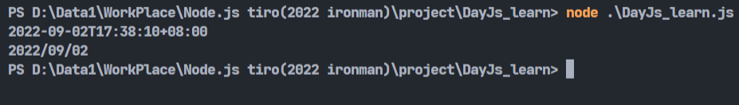
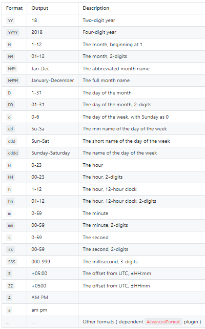
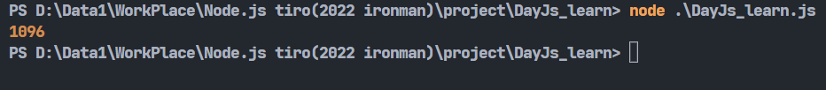
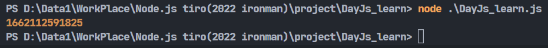
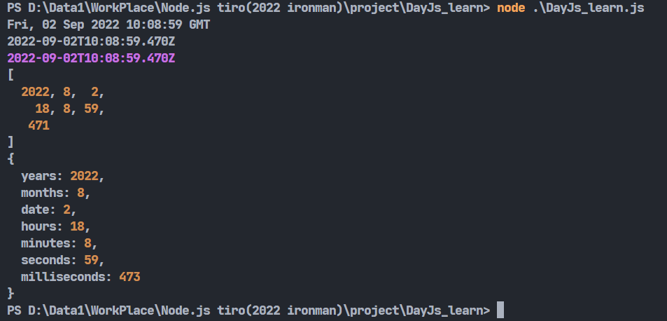
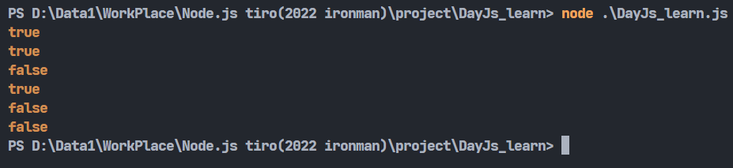
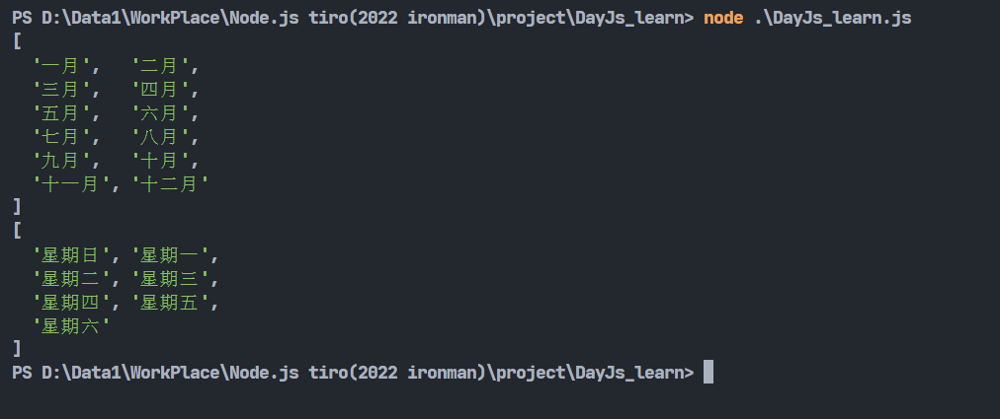
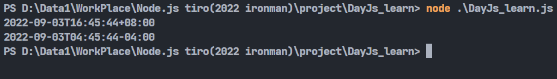
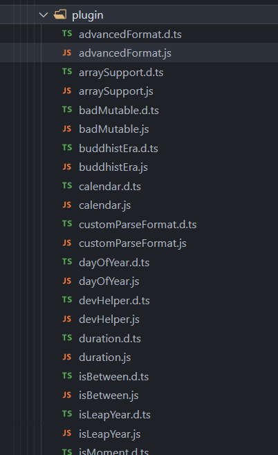

# Day20-使用DayJS來操作時間(下)

今天繼續跟著官方文檔來研究DayJS套件。

## Display

講到顯示，應該還記得昨天很常用到的format()，顧名思義，它就是拿來做格式化的函式，既然是函式，當然也能添加參數改變顯示結果:

```javascript
console.log(dayjs().format());
console.log(dayjs().format('YYYY/MM/DD'));
```


可用[參數表](https://day.js.org/docs/en/display/format)在這邊，利用這個表格就能讓日期的輸出變得符合你要的格式:



若想知道兩個日期之間相差多少天的話，可以利用diff函式功能:

```javascript
let time = dayjs();
console.log(time.diff('2019-09-02', 'day'));
```
參數分別放入要比較的日期以及要比較的單位，像是我用day參數就能算出這兩個日期之中的天數差距。



Day.js也有時間戳功能，可以利用valueOf()來得知:

```javascript
console.log(dayjs().valueOf());
```



若想將Day.js物件轉成其他的資料型態，可以使用這些函式:

```javascript
const toObject = require('dayjs/plugin/toObject');
const toArray = require('dayjs/plugin/toArray');

dayjs.extend(toObject)
dayjs.extend(toArray)

console.log(dayjs().toString());
console.log(dayjs().toISOString()); //轉成ISO標準格式
console.log(dayjs().toDate()); //轉成原生javascript Date物件

console.log(dayjs().toArray());
console.log(dayjs().toObject());
```


記得toArray()跟toObject()需要額外引入。

## Query

Day.js有專門的函式用來查詢不同時間之間的關係:

* isSame():判斷兩個時間是否相同。
* isBefore():判斷一個時間是否在另一個時間之前。
* isAfter():判斷一個時間是否在另一個時間之後。
* isDayjs():判斷目標是否為Day.js物件。
* isBetween():判斷一個時間是否在另外兩個時間之間。需引入IsBetween。
* isLeapYear():查詢目標是否為閏年。需引入IsLeapYear。
  

```javascript
const IsBetween = require('dayjs/plugin/IsBetween');
const IsLeapYear = require('dayjs/plugin/IsLeapYear');

dayjs.extend(IsBetween);
dayjs.extend(IsLeapYear);

console.log(dayjs('2022-09-02').isSame('2022-09-03','month')); //放入第二個參數用來判斷指定資訊
console.log(dayjs('2022-09-02').isBefore('2022-09-03'));
console.log(dayjs('2022-09-02').isAfter('2022-09-03','day'));
console.log(dayjs.isDayjs(dayjs()));
console.log(dayjs('2022-09-02').isBetween('2022-09-03','2022-09-04'));
console.log(dayjs('2022-09-03').isLeapYear());
```



## i18n

Day.js可以從/locale/裡面加載語言的設定，可以將當前語系從英文切到其他語言:

```javascript
require('dayjs/locale/zh-tw');

dayjs.locale('zh-tw');
```
可以引入localeData來看更改語系後的結果:


```javascript
const localeData = require('dayjs/plugin/localeData');
require('dayjs/locale/zh-tw');

dayjs.locale('zh-tw');
dayjs.extend(localeData);

console.log(dayjs.months());
console.log(dayjs.weekdays());
```



可以看到語系被修改成繁體中文了。

## Time Zone

如果不知道當地的時區，就沒辦法利用utcOffset()來修改時區了，這時候除了上網找當地的時區之外，Day.js也很貼心的準備了timezone這個插件來調整時區:

```javascript
const utc = require('dayjs/plugin/utc');
const timezone = require('dayjs/plugin/timezone');

dayjs.extend(utc);
dayjs.extend(timezone);

console.log(dayjs().format());
console.log(dayjs().tz("America/New_York").format());
```


可以看到引入timezone跟utc後就能自由的轉變時區了。

Day.js還提供了很多豐富的插件，想要聊解的可以去官網補充，因為插件太多這邊就不一一贅述。



Day.js算是我看過蠻完整的時間套件，完整到我講了兩篇其實很多功能還沒講到。明天來看看怎麼利用net套件進行封包傳送。