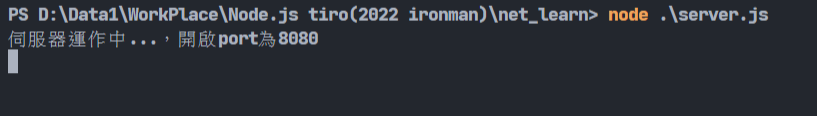
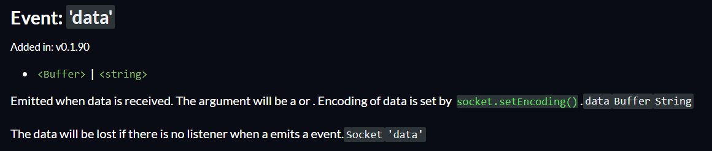
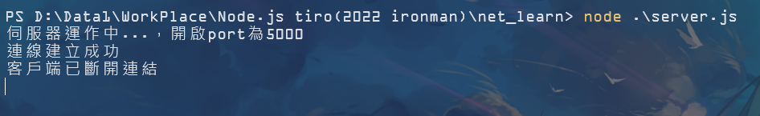
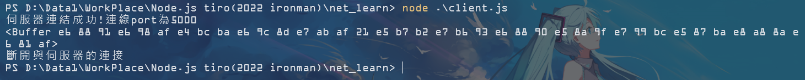
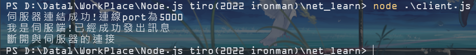

# Day21-net套件初次接觸

前幾天在其他網站上看到net套件的使用，感覺很有學習價值就來試試看了。net套件主要是用來進行通信的模組，它也是內建模組，直接引入即可:

```javascript
const net = require('net');
```

這次的目標主要是學習建立兩個程式，分別為伺服端(server)以及客戶端(client)，伺服端能發訊息給連上的客戶端。先來處理伺服端吧!

## 伺服端(server)

net提供建立伺服器的函式叫做createServer()，在裡面帶入一個參數讓後面可以使用，並且只要有連線建立就會提醒說連線建立成功:

```javascript
const server = net.createServer((c) => {
    console.log('連線建立成功');
});
```

再來我們使用write()來傳送資料，並且建立一個事件用來接收客戶端關閉的資訊:

```javascript
c.write('我是伺服端!已經成功發出訊息');
c.on('end', ()=> {
    console.log('客戶端已斷開連結');
})
```
這邊的事件名稱是end。根據官方說法，end事件會不允許之後的write事件，也就是不能在進行寫入的動作，我們使用這個事件來讓客戶端告知它的寫入完畢，讓伺服端可以顯示客戶端斷開連結的訊息。

設定完了之後就是啟動伺服器啦!可以利用listen這個方法來啟動伺服器，我們可以放入port跟host等參數，不過今天測試的只有一台電腦，所以只需要填入port就好:

```javascript
const port = 5000;
server.listen(port, ()=> {
  console.log(`伺服器運作中...，開啟port為${port}`);
});
```

可以執行看看，應該是沒什麼問題。再來就來處理客戶端吧!



## 客戶端(client)

之後創建一個新檔案來處理客戶端(client)。不同於伺服端，這邊要跟伺服器做連線，要使用connect():

```javascript
const net = require('net');

const port = 5000;
const client = net.connect(port, ()=> {
    console.log(`伺服器連結成功!連線port為${port}`);
});
```

再來要來接收伺服器傳送的事件了，一樣翻翻官網的事件列表，找到data這個事件:



當接受到資料後會動作的函式，它回傳函式中自帶的參數為資料本身，所以我們可以直接將資料顯示出來:

```javascript
client.on('data', (message) =>{
    console.log(message);
    console.log('斷開與伺服器的連接');
    client.end();
});
```

顯示完資料後記得要呼叫end()，讓伺服端收到後顯示客戶端已斷開連結的訊息。這樣就完工了，啟動伺服端後再啟動客戶端看看:





忘記轉成字串了，回去改一下程式:
```javascript
console.log(message.toString());
```



這樣就能顯示出文字囉!

這個套件如果繼續鑽研甚至能寫出聊天系統(?)，以後可能會挑戰看看吧。今天就先到這吧，附上完整程式碼:

**server:**

```javascript
const net = require('net');

const server = net.createServer((c) => {
    console.log('連線建立成功');
    c.write('我是伺服端!已經成功發出訊息');
    c.on('end', ()=> {
      console.log('客戶端已斷開連結');
    });
});

const port = 5000;
server.listen(port, ()=> {
  console.log(`伺服器運作中...，開啟port為${port}`);
});
```

**client:**

```javascript
const net = require('net');

const port = 5000;
const client = net.connect(port, ()=> {
    console.log(`伺服器連結成功!連線port為${port}`);
});

client.on('data', (message) =>{
    console.log(message.toString());
    console.log('斷開與伺服器的連接');
    client.end();
});
```