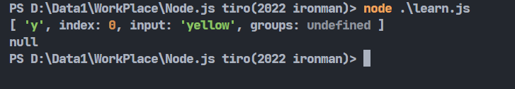
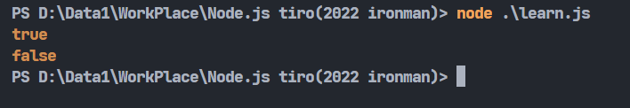
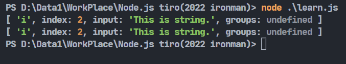
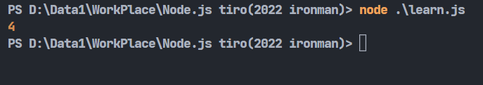
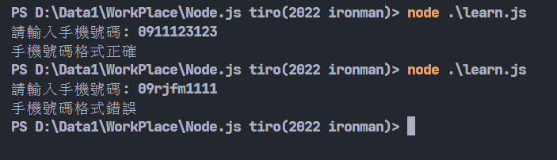

# Day22-使用正則表達式進行字串匹配

原本要繼續打Node的套件的，可是突然想到忘記講這個常用的東西，趕快來惡補(

前面有學到了很多有關於字串的操作。今天要來學習的是用來匹配字串的正則表達式(或叫正規表達式)，這是一種表達格式，用來找尋符合需求的字串。

正則表達式的創建有兩種，一種是使用javascript的內建物件建構式-RegExp來建立，一種是利用利用`/`包住正則表達式來表示它:

```javascript
let reg1 = new RegExp('^j');
let reg2 = /^j/;
```

正則表達式有許多規則，需要利用這些規則去組織想要的字串格式再去做操作。以下整理了幾個常見的正規表達式匹配字元:

* `^`: 匹配字串的開頭。
* `$`: 匹配字串的結尾。
* `+`: 匹配字串1次或以上。
* `*`: 匹配字串0次或以上。
* `?`: 匹配字串0次或1次。
* `{n}`: 規定指定的字元發生的次數，n為正整數。
* `{n,m}`: 規定指定的字元發生的次數，n為最小，m為最大，n、m為正整數。
* `x|y`:符合x或y字串。
* `[xyz]`:為xyz的字串。
* `[^xyz]`:非xyz的字串。
* `\w`:匹配所有的數字字母跟底線。
* `\W`:匹配所有的非數字字母跟底線。

函式的用法有下列這幾種:

* `exec()`:判斷字串是否符合正規表達式，若符合會回傳一個陣列裡面有關於匹配的資訊，不符合會回傳一個空值。
  
```javascript
let str1 = "yellow";
let str2 = "greeen";
let regex = /^y/;
console.log(regex.exec(str1));
console.log(regex.exec(str2));
```



* `test()`:判斷字串是否符合正規表達式。不同於exec()，它只會回傳true或false。上一個程式碼的例子改寫成test()的結果就會變成這樣:



* `match()`:跟exex()差不多的東西，不過比較需要注意的是exec()是regex的方法，而match()String的方法，以下範例可以看到兩種的寫法String跟Regex是需要反過來的:

```javascript
let str = "This is string.";
let regex = /[is]/;
console.log(str.match(regex));
console.log(regex.exec(str));
```



* `search()`:一樣是string的方法，它會回傳第一個匹配到的字串的位置:

```javascript
let str = "Javascript";
let regex = /[s]/;
console.log(str.search(regex));
```



正則表達式實際到底可以怎麼運用呢?假設我想判斷使用者輸入的是否為手機號碼的格式，就可以像這樣寫一個正則表達式的判斷程式:

```javascript
const readline = require('readline').createInterface({
    input: process.stdin,
    output: process.stdout
})
readline.question('請輸入手機號碼: ', (phoneNumber) => {
    const reg = /[0-9]{10}/;
    if(reg.test(phoneNumber)) console.log('手機號碼格式正確');
    else  console.log('手機號碼格式錯誤');
    readline.close();
})
```



這邊reg之中用了`[0-9]`帶表只能是0到9的數字並且限定只能有10個字元，這樣就能判斷使用者的輸入格式是否正確了。

正規表達式也用在很多像是註冊、驗證的地方，像是辦帳號的時候的檢查gmail格式等，在開發使用者系統有很大的幫助。