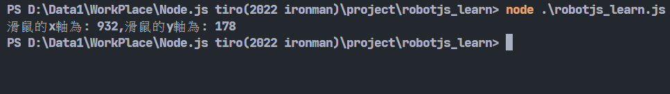

# Day23-使用robotjs自動化控制滑鼠及鍵盤

去年才寫過Python的控制鍵盤滑鼠套件-PyAutoGUI。今年學Javascript當然也不能錯過啦!在Node.js中，當然也有控制滑鼠及鍵盤的套件，這個套件就是今天要介紹的主題-robotjs。

```bash
npm install robotjs
```

先來看看滑鼠有甚麼控制的功能吧!

## 滑鼠控制

剛開始我們當然要先知道要點擊的位置的座標拉，我們可以利用以下這個函式來得知滑鼠的位置:

* getMousePos(): 回傳滑鼠目前的位置。

不過如果直接使用一定會有一個問題，阿我一執行程式就馬上判斷了，滑鼠根本來不及移動到指定地點阿，這時候怎麼辦呢?<del>當然是多練手速阿(並不是)</del>。我們可以使用setTimeout()這個功能來做延遲，讓程式等待指定時間後再執行:

```javascript
const robotjs = require("robotjs");

setTimeout(() => {
    let mouse = robotjs.getMousePos();
    console.log(`滑鼠的x軸為: ${mouse.x},滑鼠的y軸為: ${mouse.y}`);
}, 5000); //這邊的時間單位是毫秒(ms)
```



再來我們可以利用以下這兩個函式去自動化移動我們的滑鼠:

* moveMouse(x, y): 將滑鼠移動到指定座標:
* moveMouseSmooth(x, y): 將滑鼠用**人類的方式**移動到指定座標:

這兩個差在哪呢?其實只是差在移動方式。moveMouse()會直接讓滑鼠"閃現"到指定座標，moveMouseSmooth()則會像人在使用電腦一樣，滑鼠是被"滑"過去的。用法很簡單，輸入想要的座標就好:

```javascript
setTimeout(() => {
    let mouse = robotjs.getMousePos();
    console.log(`滑鼠的x軸為: ${mouse.x},滑鼠的y軸為: ${mouse.y}`);
    robotjs.moveMouse(500, 500);
    mouse = robotjs.getMousePos();
    console.log(`滑鼠的x軸為: ${mouse.x},滑鼠的y軸為: ${mouse.y}`);
    robotjs.moveMouseSmooth(250, 250);
    mouse = robotjs.getMousePos();
    console.log(`滑鼠的x軸為: ${mouse.x},滑鼠的y軸為: ${mouse.y}`);
}, 5000); //這邊的時間單位是毫秒(ms)
```


實際上會有一點誤差。實際執行就能注意到閃過去跟滑的感覺了，不過滑因為需要時間移動過去所以不適合需要馬上做的事情，若要用的話要注意誤差時間，既然提到延遲，就來講講延遲用的函式吧:

* setMouseDelay(ms): 設置滑鼠事件**後**的延遲。不帶參數的話預設為10ms。

這個函式是設定**全部的**滑鼠事件，下面舉一些例子:

```javascript
robotjs.setMouseDelay(5000);

robotjs.moveMouse(250, 250);//將滑鼠移動到(250,250)，等待5秒再執行下一行
robotjs.moveMouse(500, 500);//然後將滑鼠移動到(500, 500)，等待5秒再執行下一行
console.log('我延遲了')
```

滑鼠除了移動外，還需要點擊才會有作用，接下來緊接著講點擊的函式:

* mouseClick([button], [double]): 滑鼠點擊，這邊有兩個參數，button為選擇你要暗下的鍵，有left、right跟middle可以選，double為要不要點擊兩次，預設為false(只點擊一次):

```javascript
robotjs.mouseClick('right') //點擊右鍵
robotjs.mouseClick('left',true) //點擊左鍵兩次
```
* mouseToggle([down], [button]): 切換滑鼠的狀態，分別為按下跟鬆開，第一個參數可選擇down或up，預設為down，第二個參數為選擇要對哪個鍵切換，跟上個函式一樣有left、right跟middle可以選，預設為left:

```javascript
robotjs.setMouseDelay(5000);

robotjs.mouseToggle("down"); //按下左鍵等五秒
robotjs.mouseToggle("up"); //鬆開左鍵
```

若想按著特定的鍵移動滑鼠，官方提供了dragMouse()，可以配合mouseToggle()做到這點:

* dragMouse(x, y): 配合mouseToggle()，按著特定按鍵移動到指定座標。
  
```javascript
robotjs.mouseToggle("down"); //按下左鍵等
robotjs.dragMouse(250, 250); //移移動到(250,250)
robotjs.mouseToggle("up"); //鬆開左鍵
```
滑鼠就差不多這些了，再來我們來看看鍵盤的功能吧:

## 鍵盤控制

* keyTap(key, [modifier]): 按下一個按鍵。基本上按鍵直接打出來就好，不過像是特殊按鍵像是螢幕截圖之類的照看[官方的表格](http://robotjs.io/docs/syntax#keyboard)撰寫。modifier是修飾用的參數，支援alt、command(win)、control跟shift，若有多個參數也能用陣列來表示。

```javascript
robotjs.keyTap('s') //s
robotjs.keyTap('s','shift') //S
```
* keyToggle(key, down, [modifier]): 控制按鍵的狀態，中間down跟滑鼠的部分一樣有down或up可選:

```javascript
robotjs.keyToggle('control', 'down')
robotjs.keyToggle('shift', 'down')
robotjs.keyToggle('escape', 'down')
robotjs.keyToggle('control', 'up')
robotjs.keyToggle('shift', 'up')
robotjs.keyToggle('escape', 'up')
//按住control、shift、esc來啟動工作管理員
```
若你想輸入一個字串，robotjs提供typeString()函式:

* typeString(string): 輸入一個字串。

```javascript
const robotjs = require("robotjs");

setTimeout(()=>{
    robotjs.typeString('Node.js');
}, 5000);
```
執行程式後點擊其他可以輸入的地方，就可以看到等五秒後程式就會幫我們把"Node.js"打出來了喔!


鍵盤也有延遲的函式，分別為以下兩個:

* setKeyboardDelay(ms): 設置鍵盤事件**後**的延遲，。基本上跟滑鼠的一樣這邊就不多做示範。
* typeStringDelayed(string, cpm): 設定輸入字串要以甚麼速度輸入，cpm為每分鐘的字元數:

```javascript
setTimeout(()=>{
    robotjs.typeStringDelayed('Node.js', 60)
}, 5000); //每分鐘輸入60個字元 => 1秒一個字元
```

這個套件除了滑鼠以及鍵盤以外，也有堤供取得螢幕資訊的功能，可以利用這個套件得知特定位置的顏色資訊或是獲取螢幕長寬進而進行一些操作等等:

* getScreenSize(): 回傳螢幕大小。
* getPixelColor(x, y): 取得指定座標的像素顏色。
* screen.capture([x], [y], [width], [height]): 取得部分的螢幕，若不帶參數將會獲得全螢幕的bitmap object(點陣圖物件)，這是一個官方設計的物件，裡面的資訊有這些:


* colorAt(): 從點陣圖物件中獲得指定座標的像素顏色，使用方法像是這樣:

```javascript
let bitmap = robotjs.screen.capture(250, 250, 500, 500);
console.log(bitmap.colorAt(0, 0));
```


這樣就講完這個自動控制滑鼠、鍵盤的套件了!有的時候懶得做一些事情時真的會想要寫一個小程式讓他自己跑呢~