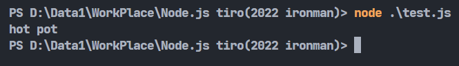
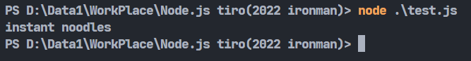
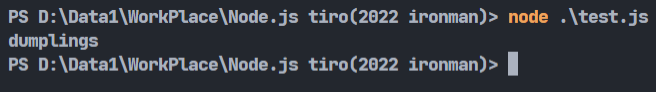
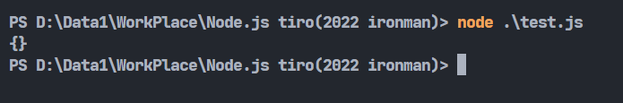
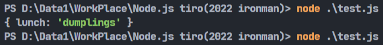

# Day24-JavaScript的Object以及Object.create()

今天終於要來講到JS一個很常看到，但又感覺很陌生的資料型態-Object。別問我標題為甚麼那麼長，因為這篇我不打算講Object的眾多方法要如何使用，這次會來專門研究Object.create()這個方法。那廢話不多說直接開始吧!

## Object是甚麼

JS中的Object其實有點像Python的Dict，也就是多個鍵對鍵值的集合。Object中可以存放無數組鍵對鍵值，每一組可以被稱做這個物件的屬性。Object因為鍵對鍵值的特性，所以對於描述物件的各種特徵可以非常的清楚，不會像陣列一樣只有索引值可以作為參考。

## Object的建立

Object可以使用兩種方式建立，一種是使用建構式，一種是使用`{}`來建立:

```javascript
let obj1 = new Object();
let obj2 = {};
let obj3 = {breakfast:'sandwich', lunch:'hot pot', dinner:'pasta'};
```

## Object的取值以及修改

想要從Object裡面取出值可以使用`.`來取值:

```javascript
let obj = {breakfast:'sandwich', lunch:'hot pot', dinner:'pasta'};
console.log(obj.lunch);
```



修改的話直接修改那個屬性即可:

```javascript
let obj = {breakfast:'sandwich', lunch:'hot pot', dinner:'pasta'};
obj.dinner = "instant noodles";
console.log(obj.dinner);
```



## Object.create()

Object其實有蠻多可以使用的功能的，都可以在[MDN](https://developer.mozilla.org/zh-TW/docs/Web/JavaScript/Reference/Global_Objects/Object)官網上查到。我在閱讀相關文章時看到了create()這個功能，覺得這是個蠻重要的函式，所以這邊會來專門講一下create()。

create()的功能主要是使用一個Object創建新的Object。大部分人看到這敘述會不知道在幹嘛，直接上程式碼:

```javascript
let obj1 = {breakfast:'sandwich', lunch:'hot pot', dinner:'pasta'};
let obj2 = Object.create(obj1);
console.log(obj2.lunch); //hot pot
```

可以看到輸出的東西會跟原本的Object一樣(?)。要修改物件只要直接修改想要的屬性即可:

```javascript
obj2.lunch = "dumplings";
console.log(obj2.lunch);
```



但是真的只有這樣嗎，若你這樣打的話...

```javascript
let obj1 = {breakfast:'sandwich', lunch:'hot pot', dinner:'pasta'};
let obj2 = Object.create(obj1);
console.log(obj2);
```



它會是空的。對，我剛開始看到時真的是滿頭疑惑，不是已經將它**複製**過來了嗎?怎麼會沒東西，然後取個別屬性又有東西呢?馬上開始仔細閱讀MDN以及各大文章，才發現那其實根本不是所謂的**複製**。

## 繼承

說起繼承，我覺得遺傳其實更加貼切一點。繼承的意思其實就是將父輩的資訊遺傳給子輩，但實際上兒子一定會跟爸爸不一樣，所以作為一個新的個體，剛剛利用create()創造出來的新Object會是空的，那為甚麼我們剛剛去查它的值可以找到hot pot呢?其實是因為原型鏈的概念。

## 原型鏈

原型鏈是一種javascript的概念。javascript的所有的對象都有自己的一個屬性指向此對象的原型(也就是繼承的概念)，一直向上指，指到最終的對象，這個最終對象也就是最頂層的原型鏈，它指向原型對象的屬性值為null，這就是原型鍵的概念。

那再來談談剛剛的問題，為甚麼繼承過後可以讀到指定的屬性值呢?這是因為當找不到屬性時，它會利用原型鏈向上查詢，若上層沒有就會繼續往上，以此類推，所以我們顯示出來的實際上是上層(obj1)繼承過來的屬性值。

## property shadowing

property shadowing其實就是剛剛我們修改屬性的例子:

```javascript
let obj1 = {breakfast:'sandwich', lunch:'hot pot', dinner:'pasta'};
let obj2 = Object.create(obj1);
obj2.lunch = "dumplings";
console.log(obj2);
```
我們可以輸出整個obj2來看看，可以看到以下畫面:



可以看到這個Object終於有屬於它的屬性了，不過因為原型鏈的規則，當子輩有相同屬性時就不會再像上搜尋了，所以之前繼承的屬性就會被覆蓋掉了，這就被稱為property shadowing(屬性遮蔽)。

所以繼承到底有甚麼好處呢?除了一些制式化的物件可以透過繼承得到該屬性的預設值以外，若有不同的物件但有類似的屬性，建立很多次這樣下來就會很浪費記憶體，若可以利用繼承就能省下一些記憶體成本。

參考資料:https://developer.mozilla.org/zh-CN/docs/Web/JavaScript/Inheritance_and_the_prototype_chain