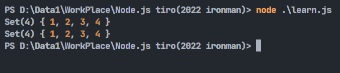
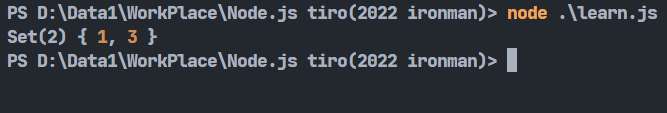
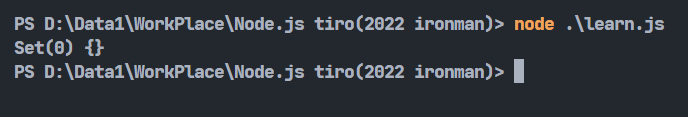
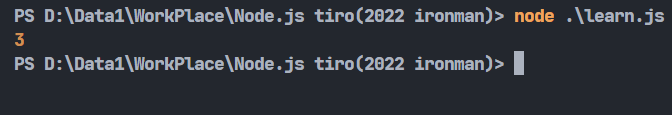
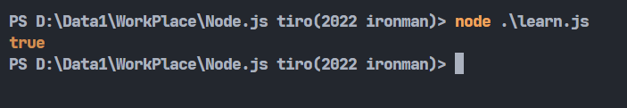
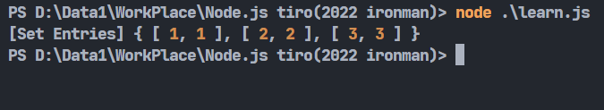
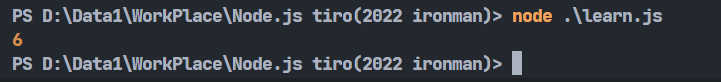

# Day25-JS的Set物件

今天來介紹類似於陣列的Set物件。

## 建立Set

Set物件有點像是擁有**唯一**值的陣列。建立Set物件跟建立陣列差不多:

```javascript
let set = new Set([1,2,3]);
```

這樣就建立了一個帶有1、2、3的Set了。再來講講有甚麼是可以拿來用的功能。

## Set的各種函式及功能

* add(): 向指定的Set物件增加新值。因為Set物件是只有唯一的值，所以若丟入一樣的值，set物件將不會有任何變化。

```javascript
let set = new Set([1,2,3]);
set.add(4);
console.log(set)
set.add(1);
console.log(set)
```



* delete(): 刪除指定的值。

```javascript
let set = new Set([1,2,3]);
set.delete(2);
console.log(set)
```



* clear(): 清空整個Set物件。

```javascript
let set = new Set([1,2,3]);
set.clear(2);
console.log(set)
```



* size: 傳回Set物件中有幾個值。

```javascript
let set = new Set([1,2,3]);
console.log(set.size);
```



* has(): 判斷當前值有沒有在Set物件中。

```javascript
let set = new Set([1,2,3]);
console.log(set.has(2));
```



* entries(): 將每個值變成[value, value]的陣列形式然後組成一個Iterator:

```javascript
let set = new Set([1,2,3]);

let iterator = set.entries();
console.log(iterator);
```



* values(): 將每個值組成一個Iterator。方便之後做讀取或操作。

```javascript
let set = new Set([1,2,3]);

let iterator = set.values();
let num = 0;

for(let value of iterator) num += value;
console.log(num);
```



其實還有一個keys()，不過在Set這邊兩個函式沒有差很多，所以就跳過。

* forEach(): for迴圈的精簡版(?)，每次執行時調用一次Set中的值。將上面的程式用forEach()改寫會變成這樣:

```javascript
let set = new Set([1,2,3]);

let num = 0;

set.forEach((value)=>{num += value;});
console.log(num);
```

這樣結果也還是會是6。