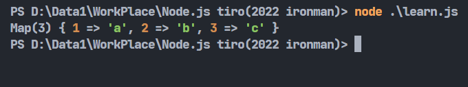
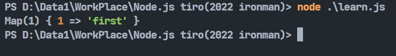
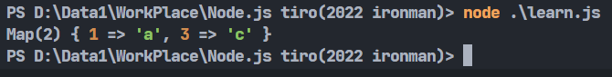
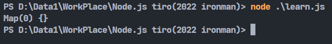
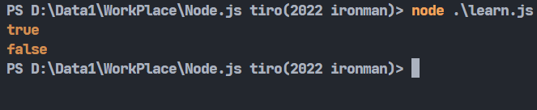
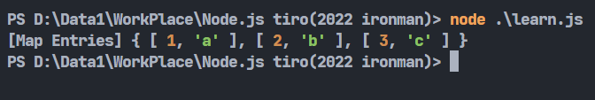
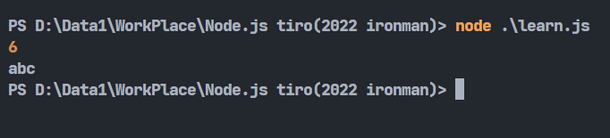

# Day26-JS的Map物件

今天來講一下JS的另外一個物件-Map。有趣的是，我在研究完Map後才發現，他可用的功能跟昨天提到的Set幾乎一模一樣，不過為了主題性還是一樣把它分兩篇，不過這兩篇重複性應該會很高就是了(

那麼。就來講講Map到底是甚麼吧。應該很多人都知道其他程式語言可能會有的dict(字典)型態吧，dict跟array(陣列)的最大特點就是鍵對鍵值，鍵對鍵值顧名思義就是每個鍵都會對應到每個值，整個dict就是由很多組鍵對鍵值所構成的。那這個功能在javascript我們可以使用Map這個物件去實現它。

## 建立Map

建立Map也非常的簡單，可以直接呼叫Map()建構式去建立一個空的Map物件:

```javascript
let map = new Map();
```

或是用建構式建立有值的Map:

```javascript
let map = new Map([[1, 'a'],[2, 'b'],[3, 'c']]);
```

這邊可以看到Map的寫法跟dict還是有點不一樣的，它不是使用`:`來區分鍵與值，而是每個`[]`之中的第一個值是鍵，第二個則是值。

那如果我丟入第三個值會怎麼樣呢，好奇實驗了一下，不會抱錯，不過好像建立的時候它就會被清掉了:

```javascript
let map = new Map([[1, 'a', 'z'],[2, 'b', 'v'],[3, 'c', 5],]);
console.log(map)
```



那如果要用新增的方式向空Map添加新的鍵對鍵值呢，我們接著看下去...

## 新增

* set(): 向Map物件添加新的鍵對鍵值。

不同於Set物件的add()，這邊我們要使用set()來添加新的鍵對鍵值:

```javascript
let map = new Map();

map.set(1, 'first');
console.log(map)
```



## 刪除

刪除跟Set物件一樣，有delete()跟clear():

* delete(): 刪除指定的值，記得是以鍵為主，畢竟鍵才是用來代表那一項。

```javascript
let map = new Map([[1, 'a'],[2, 'b'],[3, 'c']]);

map.delete(2);
console.log(map)
```



* clear(): 清空整個Map物件。

```javascript
let map = new Map([[1, 'a'],[2, 'b'],[3, 'c']]);

map.clear();
console.log(map)
```



## 判斷

* has(): 判斷該鍵有沒有存在於Map物件中。

```javascript
let map = new Map([[1, 'a'],[2, 'b'],[3, 'c']]);

console.log(map.has(2));
console.log(map.has('a'));
```



## Iterator

* entries(): 將每對鍵值變成[key, value]的陣列形式然後組成一個Iterator:

```javascript
let map = new Map([[1, 'a'],[2, 'b'],[3, 'c']]);

let iterator = map.entries();
console.log(iterator);
```



* keys(): 將每個鍵組成一個Iterator。方便之後做讀取或操作。
* values(): 將每個值組成一個Iterator。方便之後做讀取或操作。

```javascript
let map = new Map([[1, 'a'],[2, 'b'],[3, 'c']]);

let iterator1 = map.keys();
let iterator2 = map.values();
let num1 = 0;
let num2 = '';

for(let key of iterator1) num1 += key;
for(let value of iterator2) num2 += value;
console.log(num1);
console.log(num2);
```



* forEach(): for迴圈的精簡版(?)，每次執行時調用一次Set中的值。將上面的程式用forEach()改寫會變成這樣:

```javascript
let map = new Map([[1, 'a'],[2, 'b'],[3, 'c']]);

let num1 = 0;
let num2 = '';

map.forEach((value, key)=>{
    num1 += key;
    num2 += value;
});
console.log(num1);
console.log(num2);
```

這邊注意參數的順序是值先再來才是鍵，要注意不要放反。這個程式的結果會跟上面的結果一樣。