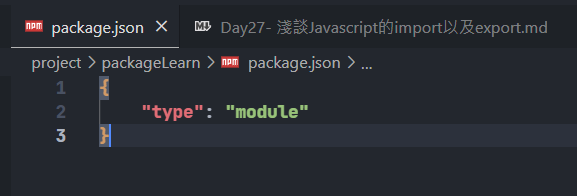
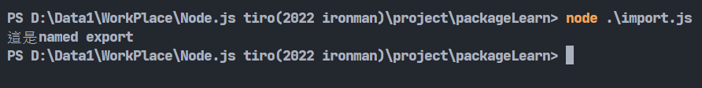
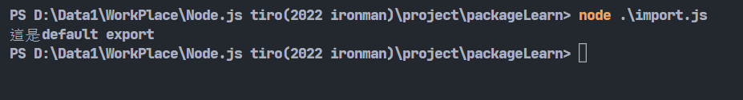

# Day27-淺談Javascript的import以及export

npm可以安裝許多好用的套件，但總會有找不到我們需要功能的套件的時候，這時候就需要自己寫程式然後做引入，才能使用符合自己需要的功能的函式。import為引入、export為匯出，利用這兩個功能，我們就可以將想要使用的函式宣告給外部檔案引用。雖然可以將程式都寫在一個檔案內，但為了維護以及重複利用，基本上會用這種方法來做**模組化**，對於程式開發是比較好的習慣。

## export

export能將一個檔案中的函式、物件、值等需要的功能匯出，在javascript中有兩種匯出的方法，分別是**named**與**default**，這兩種的差異就如同名稱所說，一個是有名稱的，另外一個當然就不需要有名稱，也就是可以使用匿名函式。不過要注意的是**default**一個檔案中只能使用一次。

### named export

```javascript
export let a = 1; //輸出常數
export let print = ()=> {console.log('export測試')}; //輸出函式(要有名字)
```

輸出函式也可以前面定義完後再輸出，寫法如下:

```javascript
let print = ()=> {console.log('export測試')};
export {print};
```

### default export

default export不需要名稱，可以直接匯出，但一個檔案就只能使用一個，像是這樣:

```javascript
export default ()=> {console.log('export測試')};
```

一個檔案的export是可以同時可以存在named跟default的。

## import

import用來引入其他檔案export的函式、物件等，這邊也會分成named的import跟default的import來講。

### named export的匯入

先建立一個資料夾，放入一個檔案叫做export.js，裡面寫一個一般的函式然後用named export的方式匯出:

```javascript
export let namedExport = ()=> {console.log('這是named export')};
```

然後再寫一import.js的檔案，負責使用export.js匯出的函式:

```javascript
import {namedExport} from './export.js';
namedExport();
```
馬上得到一個錯誤:


這邊我們可以用npm init指令建立環境並且在package.json增加`"type": "module"`這行(可以參考npm那篇)，不過因為這也不是正式的專案所以我用比較偷懶的作法，直接新增一個檔案叫`package.json`然後直接往裡面增加`"type": "module"`:



這樣基本上就可以了:



這邊我們可以看到在引入時的格式為`import {函式名稱} from '檔案路徑';`。

若有多個函式要使用，除了打很多行以外或是用逗號隔開，也可以使用*:

```javascript
import {namedExport, 其他的函式, ...} from './export.js';
import * from './export.js';
```
以上兩種作法都是可以的。`*`代表引入全部的模組，不需要使用`{}`。

若不想使用原本的名字也可以使用**as**更改名字:

```javascript
import {namedExport as a} from './export.js';
a(); //這是named export
namedExport(); //ReferenceError: namedExport is not defined
```
更改後原名字將不可用。

若只是單純想執行檔案的程式碼，可以直接這樣寫:

```javascript
import './export.js';
```
這樣的話就會**執行整個檔案的程式**。

### default export的匯入

先將export.js的檔案內容改成default export的格式:

```javascript
export default ()=> {console.log('這是default export')};
```

引入方法其實非常簡單。因為沒有名字所以不需要{}來解析，直接給它一個名字代表它就好:

```javascript
import defaultExport from './export.js';
defaultExport()
```



參考資料: [MDN-JavaScript](https://developer.mozilla.org/zh-TW/docs/Web/JavaScript)