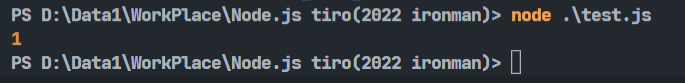
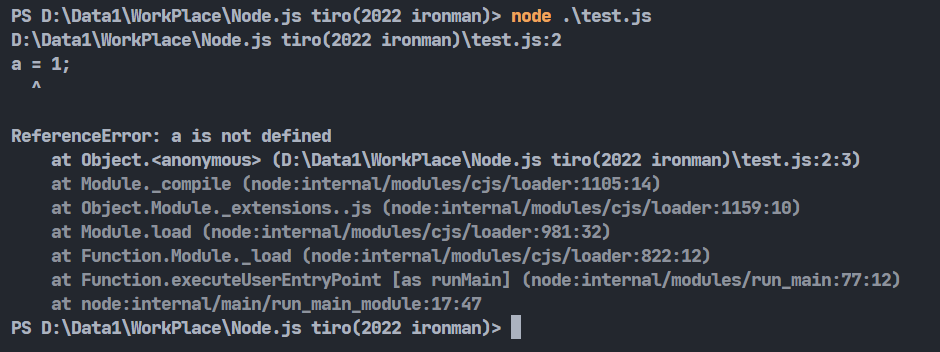
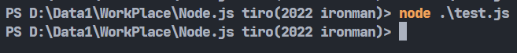
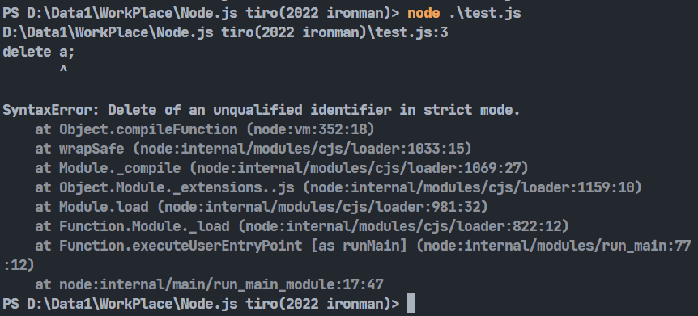
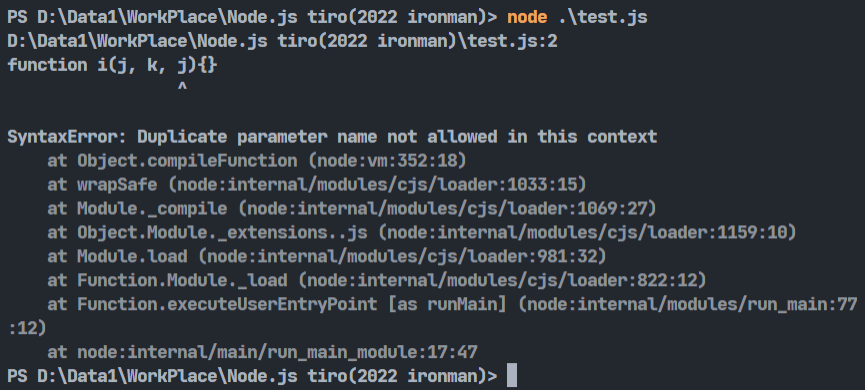
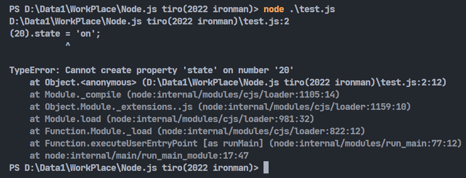
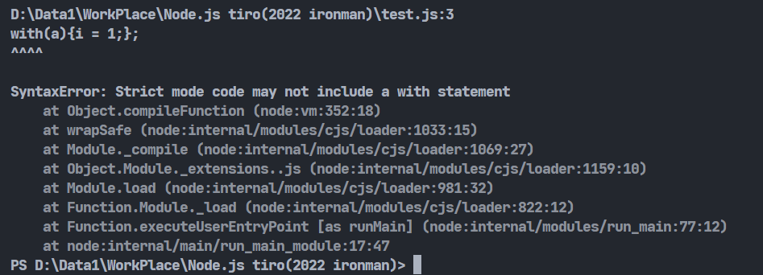

# Day28-更謹慎對待你的Code-Strict mode簡介

正當我正在逛MDN官網時，看到一個Strict mode的頁面，因為好奇才有了今天這篇文章。

## Strict mode是甚麼

因為javascript是一款很不嚴謹的語言，很多語法在某些場合會造成一些致命的錯誤。除了換成typescript這種會提醒你javascript的錯誤的語言以外，javascript本身也有提供比較嚴謹的作法，那就是本次的主題-Strict mode。

## 使用方法

使用方法很簡單，主要分為函式使用跟全局使用。全局使用的話只要在程式碼的最前面加上'use strict'就可以了，如下:

```javascript
'use strict';
let word = "strict";
```

函式使用則是要加在要使用的函式前面:

```javascript
'use strict';
function word() { return "strict"; }
```

## 舉例

```javascript
a = 1;
console.log(a);
```



在javascript中這樣寫其實能正常執行，可是它卻沒有變數宣告。這時候正是測試Strict mode的時候啦!我們在前面加上'use strict'再執行一次:

```javascript
'use strict';
a = 1;
console.log(a);
```



可以看到馬上報了一個錯，內容是ReferenceError: a is not defined，很明確地跟你說這個變數沒有宣告。

## Strict mode有可能檢查出的錯誤

所以究竟Strict mode會幫我們檢查出甚麼錯誤呢，舉幾個比較常見的狀況:

* 變數要定義。跟上面的例子一樣，沒有使用let、var、const等宣告的話會報錯。

* delete刪除變數或函式:

delete用於刪除某個物件的屬性，但你如果拿來刪除一般的變數他其實甚麼事情都不會發生:

```javascript
let a = 1;
delete a;
```



就變成說delete這行code沒有意義。這邊Strict mode就會將它當作是一個錯誤:

```javascript
'use strict';
let a = 1;
delete a;
```



* 函式參數不得重複:

```javascript
'use strict';
function i(j, k, j){}
```



* 禁止在最基礎的形態上設置屬性。像是boolean(布林值)、number(數值)等型態:

```javascript
'use strict';
(20).state = 'on';
```



* 禁止with用語法。with原本可以用來關聯特定物件進而簡化程式碼，不過這個做法有很多問題甚至會引起效能下降，所以Strict mode禁用。

```javascript
'use strict';
let a = {i:10};
with(a){i = 1;};
```



還有很多其他的限制，而且大部分的瀏覽器都支援Strict mode。所以如果不想跳槽typescript的人也可以試試看這個模式，看看會不會讓自己的code更加乾淨安全。