# Day29-URL物件 解析網址的好幫手

講到JavaScript，大部分的人會先聯想到網站、前端等詞彙。作為一個在"網路"上發光發熱的程式語言，必然支援網路上的各種操作，其中解析URL(網址)也是Javascript提供的一個功能。今天就來一探究竟這個URL到底如何使用。


## URL基本操作

要使用URL物件，要使用URL()建構式:

```javascript
let ithomeURL = new URL('https://ithelp.ithome.com.tw/articles?tab=tech');
```

這樣就能取得一個URL物件了!這個物件有許多屬性，接下來來一一介紹這些屬性式幹嘛的。

## URL屬性

* host: 獲得該網址的域名:

```javascript
console.log(ithomeURL.host);
```

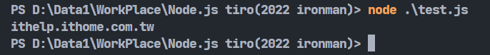

* hostname: 獲得該網址的域名。一定有很多人有疑問，那這兩個不是一樣嗎?其實還是有些微差別，若網址中有port的話，host會顯示port，hostname則不會:

```javascript
let localURL = new URL('http://127.0.0.1:5000/');
console.log(localURL.hostname);
console.log(localURL.host);
```

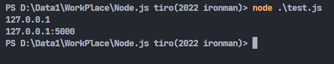

* port: 獲得該網址的port: 

```javascript
console.log(localURL.port);
```

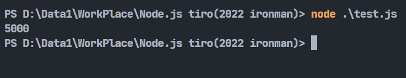

* href: 獲得該網址，這應該沒什麼好講的(

* pathname: 獲取該網址的路徑，不包含域名:

```javascript
console.log(ithomeURL.pathname);
```

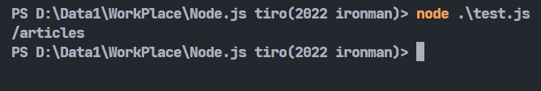

* protocol: 獲取該網址的協定:

```javascript
console.log(ithomeURL.protocol);
```

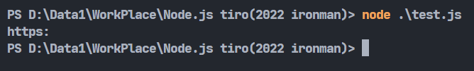

* searchParams: 獲取get的參數，網址中的<code>?</code>的後面就是get參數。要搭配get()使用:

```javascript
console.log((ithomeURL.searchParams).get('tab'));
```

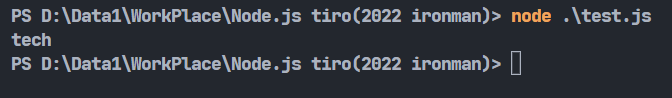

## URLSearchParams()基本操作

講完單純的URL解析，Javascript也提供了可以修改網址參數的API，那就是URLSearchParams()。

建立方式也是使用專用的建構式:

```javascript
let ithomeParams = new URLSearchParams();
```

參數部份我們可以使用物件的方式代入:

```javascript
let ithomeParams = new URLSearchParams({tab: 'job'});
```

最終要寫回到原網址內:

```javascript
let ithomeURL = new URL('https://ithelp.ithome.com.tw/');
let ithomeParams = new URLSearchParams({tab: 'job'});
ithomeURL.search = ithomeParams;
console.log(ithomeURL.href);
```

這邊用到的search跟剛剛介紹的searchParams很像，只是searchParams是read only(唯讀)，所以要使用search這個可以設定的屬性來設定。

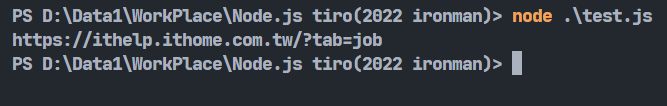

這樣就能看到屬性已經被設定上去了!

URLSearchParams()也有一些函式(方法)可以使用，接下來來介紹一下一些常用的方法。

## URLSearchParams()方法

* append(): 添加新的參數:

```javascript
let ithomeURL = new URL('https://ithelp.ithome.com.tw/');
let ithomeParams = new URLSearchParams();
ithomeParams.append('tab','job');
ithomeURL.search = ithomeParams;
console.log(ithomeURL.href);
```

結果會跟上面的例子一樣。

* delete(): 刪除指定的參數:

```javascript
let ithomeURL = new URL('https://ithelp.ithome.com.tw/?tab=job');
let ithomeParams = new URLSearchParams(ithomeURL.search);
ithomeParams.delete('tab');
ithomeURL.search = ithomeParams;
console.log(ithomeURL.href);
```

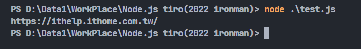

* get(): 取得參數:

```javascript
let localURL = new URL('http://127.0.0.1:5000/?language=Javascript&language=Python');
let localParams = new URLSearchParams(localURL.search);
console.log(localParams.get('language'));
```

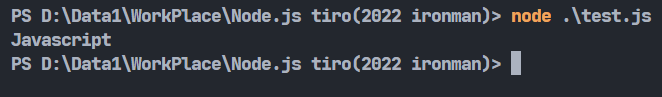

可以看到若網址內有相同參數的話會回傳第一個值。若想回傳全部的參數的話可以用getAll()。

* getAll(): 取得全部參數:

```javascript
let localURL = new URL('http://127.0.0.1:5000/?language=Javascript&language=Python');
let localParams = new URLSearchParams(localURL.search);
console.log(localParams.getAll('language'));
```

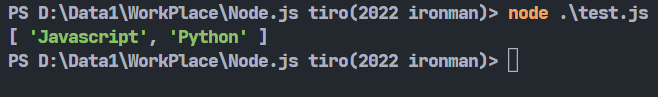

可以看到會回傳一個陣列裡面有所有'language'的參數。

* sort(): 排序參數。這功能蠻迷的，目前沒找想到有甚麼特別用途:

```javascript
let localURL = new URL('http://127.0.0.1:5000/?a=1&c=6&b=3');
let localParams = new URLSearchParams(localURL.search);
localParams.sort();
console.log(localParams);
```

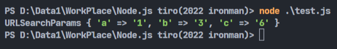

* set(): 設定參數，它與append()是很相似的功能，之間的差別在於set()是設置，所以當原本就存在該參數時會改變其值。append()則是新增一個參數:

```javascript
let localURL = new URL('http://127.0.0.1:5000/?a=1&b=2');
let localParams = new URLSearchParams(localURL.search);
localParams.set('a', 2);
console.log(localParams.toString());
localParams.append('a', 3);
console.log(localParams.toString());
```

這邊可以利用toString()這個功能將設置的參數以字串型態回傳:

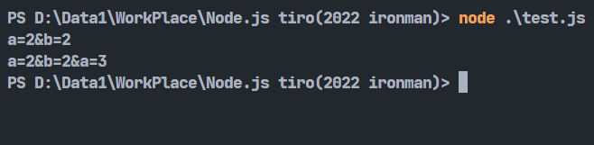

可以清楚看到兩者之間的差異。

* has(): 檢查該參數是否存在，回傳true或false。

```javascript
let localURL = new URL('http://127.0.0.1:5000/?a=1&b=2');
let localParams = new URLSearchParams(localURL.search);
console.log(localParams.has('a'));
```

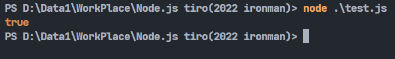

* keys(): 回傳一個iterator，裡面有所有參數的鍵，可以利用迴圈輸出:

```javascript
let localURL = new URL('http://127.0.0.1:5000/?a=1&b=2');
let localParams = new URLSearchParams(localURL.search);
for(let keys of localParams.keys()) console.log(keys);
```

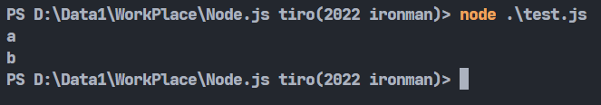

* values(): 回傳一個iterator，裡面有所有參數的值，可以利用迴圈輸出。跟上個功能差不多所以就不多做贅述:


* entries(): 回傳一個iterator，裡面有所有參數的鍵值。簡單來講就是keys()跟values()的組合版本:

```javascript
let localURL = new URL('http://127.0.0.1:5000/?a=1&b=2');
let localParams = new URLSearchParams(localURL.search);
for (const [keys, values] of localParams.entries()) console.log(`Key為${keys}, Value為${values}`);
```

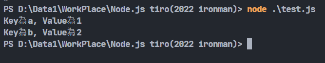

除了這種寫法之外，也可以使用forEach()，若要讀取所有的鍵值進行操作這東西會比較方便一點:

forEach():for迴圈的精簡版(?怎麼好像講過很多遍了)，每跑一次讀取一組參數到參數被讀取完畢，下面的例子跟上面的結果是一樣的:

```javascript
let localURL = new URL('http://127.0.0.1:5000/?a=1&b=2');
let localParams = new URLSearchParams(localURL.search);
localParams.forEach((values, keys) => {console.log(`Key為${keys}, Value為${values}`);});
```

其實這些API說白一點就是一些字串的操作，硬做也是可以做出來的，不過官方都專門寫好放在那了當然沒有不用的道理啊(