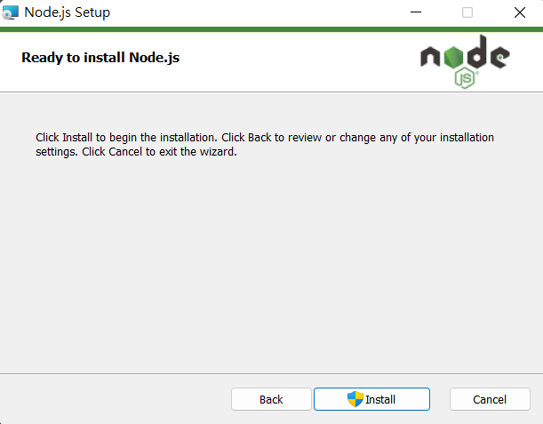
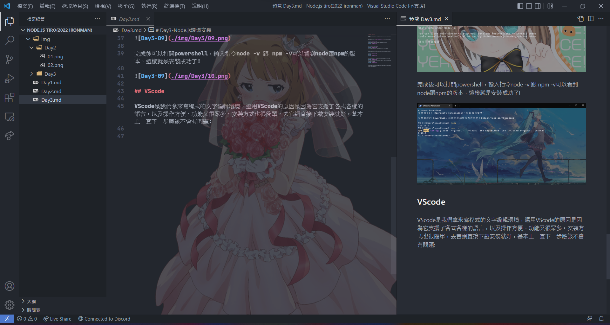

# Day3-Node.js環境安裝

今天就來安裝Node.js的環境吧，我們需要安裝Node.js本身以及文字編輯器，文字編輯器這邊我選用VScode。

## Node.js

Node.js安裝可以去[官網](https://nodejs.org/zh-tw/)下載，打開官網連結可以看到這個畫面:

這邊可以選擇要下載的版本，建議選擇長期維護版即可，下載後安裝:

這邊用來選擇安裝路徑。預設就好。

這邊用來選擇安裝的項目，會將npm等等的工具安裝好，一樣預設就好。

這邊的Automaticy install記得勾選。他會幫你自動安裝必要的工具，以防後面出現問題還是勾起來比較好。

準備安裝。

安裝完按下Finish會跳出一個命令列視窗安裝必要的工具，跑完後關掉就好了。

完成後可以打開powershell，輸入指令node -v 跟 npm -v可以看到node跟npm的版本，這樣就是安裝成功了!

## VScode

VScode是我們拿來寫程式的文字編輯環境，選用VScode的原因是因為它支援了各式各樣的語言，以及操作方便、功能又很眾多。安裝方式也很簡單，去[官網](https://ithelp.ithome.com.tw/articles/10266275)直接下載安裝就好，基本上一直下一步應該不會有問題:

vscode的畫面(沒錯我此時此刻就在用VScode打這篇文章):

這個文字編輯器除了多樣的功能外，還可以利用擴充套件來安裝一些美化VScode的小工具，基礎使用可以看我[去年鐵人賽的文章](https://ithelp.ithome.com.tw/articles/10266275)，這邊就不再贅述。

**那這篇文章就先到這邊，明天會先從JS的基礎語法開始記錄起，第一次碰這個語言，有錯誤的資訊也煩請各位大神幫忙糾正。**