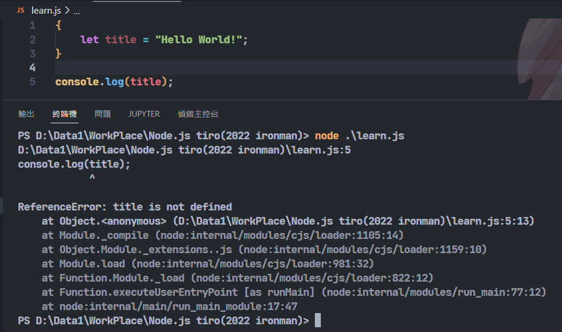

# Day4-JavaScript的變數以及資料型態

今天就直接來接觸一下這個我從未接觸的語言。俗話說的好，學程式語言要先從Hello World開始寫起，所以這邊就來寫寫看JavaScript的Hello World吧!先建立一個learn.js的檔案，然後在裡面輸入:

```JavaScript
console.log("Hello World!");
```
看來Python的print()在這裡要變成console.log()呢，再來就是句尾要有分號(?)，其餘應該沒什麼特別的。在來我們需要執行這個程式，開啟PowerShell或是命令提示字元，在裡面輸入:

```bash
node learn.js
```


執行指令就是這麼簡單!只要輸入node，然後輸入要執行的檔案名稱，Node.js就會幫你在本機端執行JavaScript程式了!

## 變數

JavaScript有宣告變數的保留詞，主要有let以及var兩種可變變數的宣告以及const這種不可變變數的宣告，爬個文發現let跟var這兩種宣告方式有一些細節上的差異:

### let與var的差異

主要的差異是因為JavaScript在ES6這個版本引入區塊作用域的概念，var是舊式的寫法，所以他只會有函式作用域的概念，也就是說，整個函式都能存取這個變數，但let有著新式的區塊作用域的概念，用<code>{}</code>可以表示一個區塊，因此，如果有個變數在<code>{}</code>內被定義，在外面是無法存取的，像是下圖這樣，node會直接跟你報錯因為它找不到此變數:



用var的話，因為它沒有區塊作用域的概念，所以可以正常執行:


建議主要使用let來定義變數，這樣可以更了解你程式的各個作用域，也方便除錯。

順帶一提，const也有區塊作用域的概念。

## 註解

JavaScript的註解跟大部分的程式語言基本上一樣，單行用<code>//</code>，多行用<code>/* */</code>包住:

```JavaScript
//  這是註解
/*
    這些
    也是
    註解
*/

```

這樣Node.js就會跳過註解的行數，不執行這幾行的東西。

## 資料型態

JavaScript不需要先定義型態，就如同上面的例子一樣，我們輸入了<code>let title = "Hello World!"</code>，它就會自動根據你給的值("Hello World!")去分配它的資料型態，JavaScript常見的資料型態有下列這些:

* 數值(Number): JavaScript在形態上沒有細分浮點數或是整數，只要是數字一律以Number這個型態表示。
* 字串(String): 表示一個字詞。
* 布林值(Boolean): 表示真或是假的布林型態。
* 空(null): 代表這個變數沒有值。
* 未定義(undefined): 代表這個變數的值還沒有被定義。

還有陣列(Array)以及物件(Object)，這個後面會提到，後面也可能會接觸到其他的資料型態。

### 變數型態確認

因為JavaScript定義變數的方式十分自由，所以在除錯時就會有些麻煩，好在官方給了**typeof**這個功能來讓程式設計師可以知道現在這個變數的資料型態到底是甚麼:


今天講述了一些變數的基本觀念，明天繼續來接觸JavaScript。