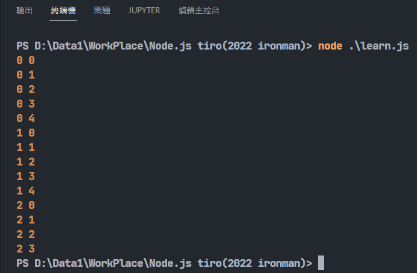

# Day7-JavaScript的迴圈

今天來討論迴圈的部份。迴圈可以幫助工程師在撰寫重複事情的時候有著更省時省力的寫法。

## for迴圈

for迴圈可說是最基本的迴圈寫法，利用`()`內的條件設置來重複執行`{}`內的程式碼:

```JavaScript
let num = 0;

for(let loop=0;loop<5;loop++){
    num += 2;
}

console.log(num);
```

`()`內用`;`分成三個部份，第一部份要先定義一個變數作為判斷的依據，之後第二部份定義條件，在這條件中，迴圈會一直執行，第三個部份讓每做完一次迴圈後執行指定的動作。以上面的例子來講，因為變數每次`++`(等同於`+=1`)，所以loop這個變數的變化為0,1,2,3,4，再來變成5的時候會因為條件不符而跳出迴圈，因此迴圈執行了5次，num最終會變成10。

## while迴圈

while迴圈只有單獨的條件，符合條件進入迴圈，不符合跳出。將上面的for迴圈改寫可以得到下面while的版本:

```javascript
let num = 0;
let loop=0;

while(loop<5){
    num += 2;
    loop++;
}

console.log(num);
```

每次執行後就將loop加1，迴圈一樣執行5次，最後loop會變成5跳出迴圈，num最後也是10。

## do while迴圈

do while是while的變形版，這個版本會先執行一次迴圈(do)，再看條件是否符合(while)再決定要不要繼續執行剛剛的程式(do)。

```javascript
let num = 5;
do {
    num++;
}while(num < 5);

console.log(num); //輸出為6
```
上面這個例子雖然while條件不符合，但會先做一次do，因此輸出為6。

## break continue

break跟continue的用法也與其他程式語言相似。碰到break就會跳出當前迴圈，碰到continue就會跳過這一次的迴圈執行，然後執行下一次的迴圈:

```javascript
for(let i=0;i<5;i++){
    if(i==1) break; //i為1就跳出迴圈
    console.log(i); //最終結果會輸出 0
}
```

```javascript
for(let i=0;i<5;i++){
    if(i==1) continue; //跳過i為1的狀況
    console.log(i); //最終結果會輸出 0 2 3 4
}
```

不過這個用法的使用場合是當前迴圈，若有雙重迴圈而且我要跳出外層迴圈的話我要怎麼做呢?javascript提供了label這個功能來指定要跳出哪個迴圈。

## label

label可以做到標記迴圈，給迴圈命名，這樣就能在使用break跟continue時指定要跳出的迴圈:

```javascript
outside:
for(let i=0;i<5;i++){
    for(let j=0;j<5;j++){
        if(i==2 && j==4) break outside;
        console.log(i,j)
    }
}
```
這個例子我使用outside標籤外面的迴圈，指定i為2且j為4的時候會跳出外部迴圈，所以這個程式的輸出會長這樣:



今天介紹了迴圈這個程式語言中重要的元素，明天來談論函式的概念。