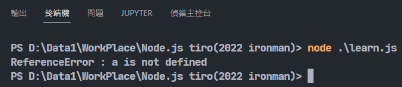
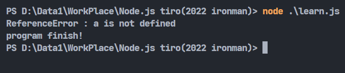
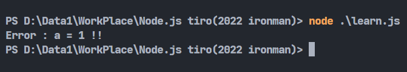

# Day9-JavaScript的例外處理

今天來講一下JavaScript的例外處理。例外處理的用途用在若程式有發生特殊狀況會報錯時，用來不讓程式停掉，可以繼續執行下去並彈出錯誤。

JavaScript有`throw`跟`try...catch`等等的用法，先來講一下`try...catch`:

## try...catch

try...catch是一般程式語言最常用的例外處理方式，利用`try`區塊判斷是否有錯誤發生，有的話會執行緊接著的`catch`區塊，沒有的話則會跳過`catch`:

```javascript
try{
    a += 1;
}catch(exception){
    console.log(`${exception.name} : ${exception.message}`)
}
```

上面的程式很明顯有錯誤，因為沒有定義`a`所以會有`ReferenceError`這個錯誤，這時候就可以用catch做某些特定的事情，這邊我選擇用一個叫exception的變數去儲存錯誤訊息，再將它顯示出來。用`.name`就可以顯示錯誤的名稱，`.message`可以顯示錯誤的描述訊息，就能看到最後會顯示這樣:



## finally

`finally`是`try...catch`的衍生用法，`try...catch`不一定會需要用到`finally。finally`是`try...catch`之後會執行的程式碼，無論有沒有進`catch`，都會執行`finally`:

```javascript
try{
    a += 1;
}catch(x){
    console.log(`${x.name} : ${x.message}`)
}finally{
    console.log('program finish!')
}
```



## throw

throw比較特別一點，它是用來讓程式設計師自訂錯誤用的，當某些不是javascript的錯誤，可是你卻不希望這類事情發生的話，就可以使用throw。假如如果我不希望變數a出現1這個值的話，就可以這樣寫:

```javascript
let a = 1;

try{
    if(a==1){
        throw new Error("a = 1 !!");
    }
}catch(x){
    console.log(`${x.name} : ${x.message}`)
}
```



利用`throw new Error`來丟出錯誤，並在後面指定錯誤的訊息，這樣就能在沒有真正的錯誤時，丟出你想要防範的狀況了。